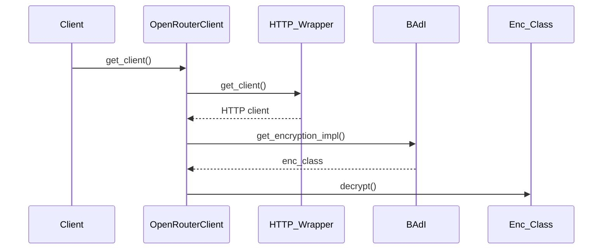

# Class ZCL_LLM_CLIENT_OPENROUTER

AI Generated documentation.

## Overview  

Provides a specialized client implementation for interacting with OpenRouter's LLM API. Inherits core LLM client functionality from base class `zcl_llm_client_base`.

**Key Public Methods**:  

1. `GET_CLIENT`  
   - Factory method creating client instances  
   - Parameters: Client config (`ZLLM_CLNT_CONFIG`), provider config (`ZLLM_PROVIDERS`)  
   - Returns: `ZIF_LLM_CLIENT` interface reference  

2. `CONSTRUCTOR`  
   - Initializes client with configurations  
   - Triggers class initialization via inherited logic  

## Dependencies  

1. **BAdI Implementation** (`ZCL_LLM_COMMON=>GET_LLM_BADI`)  
   - Used for encryption/decryption of authentication credentials  
2. **Encryption Class**  
   - Dynamic resolution via BAdI for credential decryption  
3. **HTTP Client Wrapper** (`ZCL_LLM_HTTP_CLIENT_WRAPPER`)  
   - Handles HTTP connection management  

## Details  

### Method Flow  

### Key Redefined Methods  

1. **`GET_HTTP_CLIENT`**  
   - Retrieves preconfigured HTTP client from wrapper  
   - Sets OpenRouter-specific headers:  
     - `HTTP-Referer`: Identifies calling application  
     - `X-Title`: Client identification  

2. **`SET_AUTH`**  
   - Implements bearer token authentication  
   - Decrypts credentials using BAdI-resolved encryption implementation  
   - Handles both encrypted and plaintext authentication  

3. **`CREATE_STRUCTURED_OUTPUT`**  
   - Returns OpenRouter-specific JSON structure handler (`ZCL_LLM_SO_JS_OR`)  

### Security Handling  

- Authentication credentials are stored encrypted in `PROVIDER_CONFIG-AUTH_ENCRYPTED`  
- Decryption occurs only during runtime via injected encryption implementation  

### API Endpoints  

- Chat endpoint hardcoded to `/chat/completions` (OpenRouter standard)
