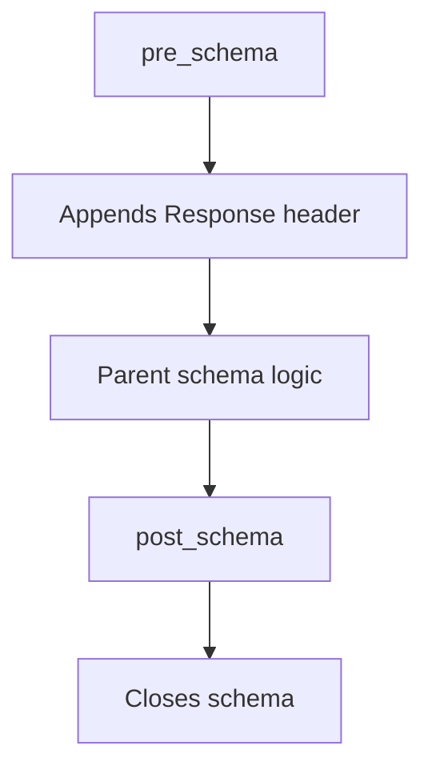

# Class ZCL_LLM_SO_JS_OR

AI Generated documentation.

## Overview  

`ZCL_LLM_SO_JS_OR` is a specialized JSON schema generator class that extends base functionality from `ZCL_LLM_SO_JS`. It focuses on building a strict "Response" schema structure through protected method redefinitions.  

**Key Aspects**:  

- Inherits core JSON schema construction logic from parent class  
- Adds schema enforcement for response objects  
- No public methods declared (inherits public interface from parent)  
- Critical redefinitions in `PRE_SCHEMA`/`POST_SCHEMA` control schema boundaries  

## Details  

### Method Flow  



**Protected Method Implementation**:  

1. `PRE_SCHEMA`:  
   - Initializes schema with strict response structure:  

   ```abap
   append_to_schema(|"name":"Response","strict":true,"schema":{|)
   ```  

   - Triggers parent class schema generation after header  

2. `POST_SCHEMA`:  
   - Finalizes schema with closing bracket  

   ```abap
   append_to_schema(|}|)
   ```  

**Design Pattern**:  

- Template Method pattern through parent class method reuse  
- Hook methods (`PRE_`/`POST_SCHEMA`) control schema bookends while delegating core implementation to ancestor class
