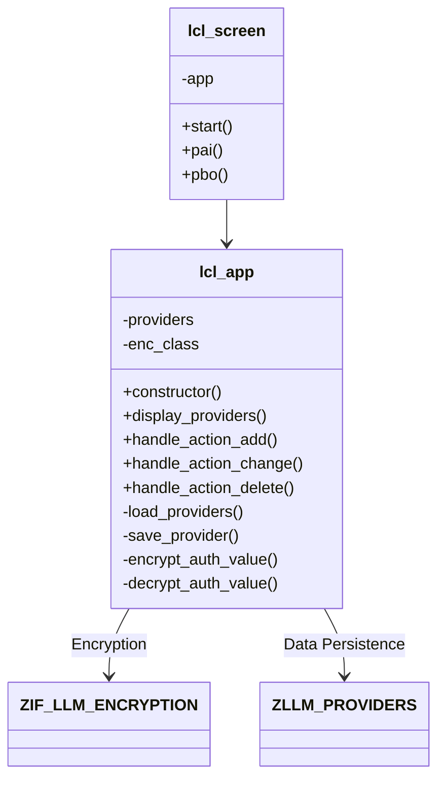
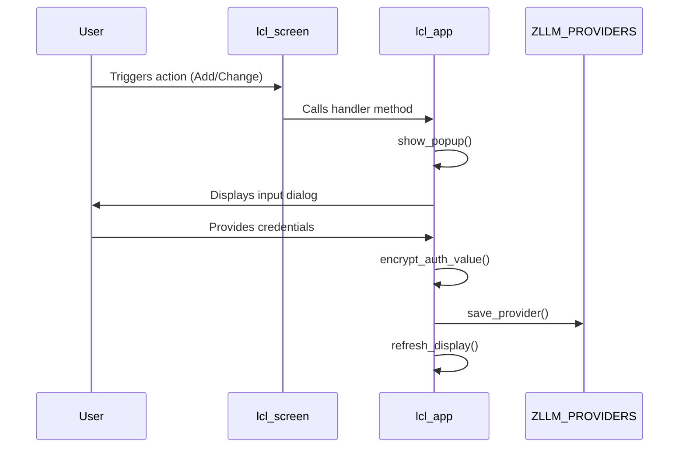

# Report ZLLM_PROVIDER_MAINTENANCE

AI Generated documentation.

## Overview  

This report provides maintenance functionality for LLM (Large Language Model) provider configurations stored in table `ZLLM_PROVIDERS`. Key features include:  

- Displaying provider configurations in an ALV grid  
- Adding/updating providers via popup dialogs with encrypted authentication value handling  
- Deleting providers after confirmation  
- Integration with a BAdI-based encryption mechanism for secure credential storage  

## Dependencies  

- **Custom Objects**:  
  - Table `ZLLM_PROVIDERS` (configuration storage)  
  - Interface `ZIF_LLM_ENCRYPTION` (encryption implementation)  
  - Exception class `ZCX_LLM_AUTHORIZATION`  
- **SAP Standard**:  
  - BAdI framework for encryption implementation resolution  
  - Function modules `POPUP_GET_VALUES` and `POPUP_TO_CONFIRM`  

## Details  

### Class Structure  

### Key Implementation Aspects  

1. **Encryption Workflow**:  
   - Authentication values are encrypted using `ZIF_LLM_ENCRYPTION` implementation retrieved via BAdI  
   - Values split across two input fields for lengths >132 characters (e.g., OpenAI keys)  

2. **ALV Integration**:  
   - Field catalog built dynamically with `LVC_FIELDCATALOG_MERGE`  
   - Sensitive `AUTH_VALUE` field excluded from direct display  

3. **Data Flow for Provider Updates**:  

4. **Security Constraints**:  
   - Encryption/decryption operations throw `ZCX_LLM_AUTHORIZATION` for missing privileges  
   - Authentication values never stored in clear text format  

5. **UI Handling**:  
   - Dedicated screen class (`lcl_screen`) manages dynpro events  
   - Selection consistency enforced (single-row selection for modifications)
