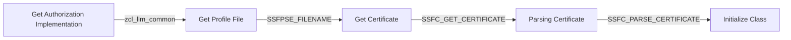
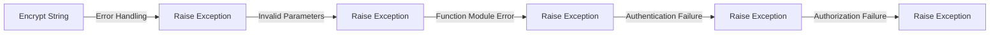
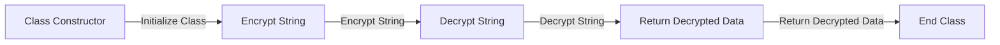

# Class ZCL_LLM_ENCRYPTION

AI Generated documentation.

## Overview

The `zcl_llm_encryption` class is a custom implementation of encryption and decryption functionality. It provides methods for encrypting and decrypting strings using the `SSF_KRN_ENVELOPE` and `SSF_KRN_DEVELOPE` function modules. The class also handles authentication and authorization through the `zcl_llm_common` class.

## Dependencies

The class depends on the following:

* `zcl_llm_common` class for authorization and authentication
* `SSF_KRN_ENVELOPE` and `SSF_KRN_DEVELOPE` function modules for encryption and decryption
* `SSFPSE_FILENAME` function module for getting the profile file
* `SSFC_GET_CERTIFICATE` function module for getting the certificate
* `SSFC_PARSE_CERTIFICATE` function module for parsing the certificate

## Details

### Class Constructor

The `class_constructor` method initializes the class by:

* Getting the authorization implementation from the `zcl_llm_common` class
* Getting the profile file using the `SSFPSE_FILENAME` function module
* Getting the certificate using the `SSFC_GET_CERTIFICATE` function module
* Parsing the certificate using the `SSFC_PARSE_CERTIFICATE` function module

### Encryption and Decryption Methods

The `encrypt` and `decrypt` methods use the `SSF_KRN_ENVELOPE` and `SSF_KRN_DEVELOPE` function modules to encrypt and decrypt strings. They handle authentication and authorization through the `zcl_llm_common` class.

```mermaid
graph LR
    A[Encrypt String] -->|SSF_KRN_ENVELOPE| B[Get Recipients]
    B -->|Get Recipients| C[Get Input Data]
    C -->|SSF_KRN_ENVELOPE| D[Encrypt Data]
    D -->|Get Encrypted Data| E[Get Decrypted Data]
    E -->|SSF_KRN_DEVELOPE| F[Decrypt Data]
    F -->|Get Decrypted Data| G[Return Decrypted Data]
```

### Error Handling

The class raises exceptions for errors that occur during encryption and decryption, such as authentication and authorization failures, function module errors, and invalid parameters.

### Class Flow

The class flow is as follows:

* The `class_constructor` method initializes the class by getting the authorization implementation, profile file, and certificate.
* The `encrypt` and `decrypt` methods use the `SSF_KRN_ENVELOPE` and `SSF_KRN_DEVELOPE` function modules to encrypt and decrypt strings.
* The class raises exceptions for errors that occur during encryption and decryption.

