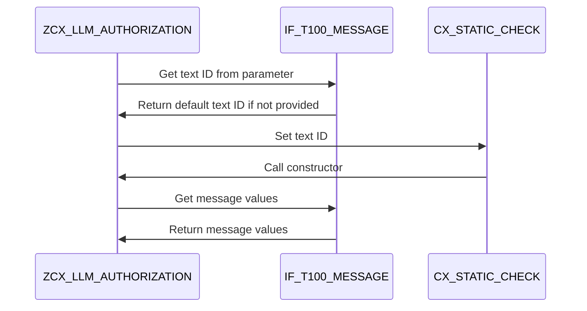

# Class ZCX_LLM_AUTHORIZATION

AI Generated documentation.
## Overview
The `ZCX_LLM_AUTHORIZATION` class is a custom exception class that inherits from `CX_STATIC_CHECK`. It provides a set of constants and methods for handling authorization-related messages. The class is designed to be used in SAP ABAP applications.

## Dependencies
The class depends on the following:

* `IF_T100_DYN_MSG`
* `IF_T100_MESSAGE`
* `CX_STATIC_CHECK`

## Details
### Class Structure

```mermaid
class ZCX_LLM_AUTHORIZATION {
  +-- CX_STATIC_CHECK
  |
  +-- IF_T100_DYN_MSG
  +-- IF_T100_MESSAGE
  |
  +-- MSGV1
  +-- MSGV2
}
```

### Methods

The class has one public method:

* `CONSTRUCTOR`: This method is used to create an instance of the class. It takes two optional parameters: `TEXTID` and `PREVIOUS`. The method sets the `textid` attribute based on the provided `TEXTID` parameter or uses the default `IF_T100_MESSAGE` text ID if not provided.

### Constants

The class defines three constants:

* `PROVIDER_MAINTENANCE`: This constant is used to handle maintenance-related messages.
* `GET_CLIENT`: This constant is used to retrieve the client ID.
* `DECRYPT` and `ENCRYPT`: These constants are used to handle encryption and decryption messages.

### Logic Flow

The class uses the `IF_T100_MESSAGE` interface to handle messages. The `CONSTRUCTOR` method sets the `textid` attribute based on the provided `TEXTID` parameter or uses the default text ID if not provided. The class also uses the `MSGV1` and `MSGV2` data objects to store message values.



