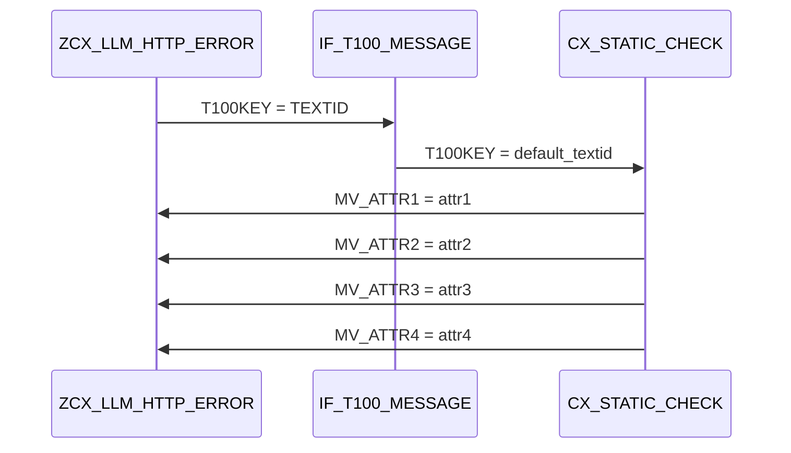
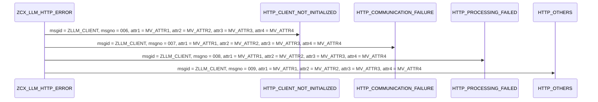

# Class ZCX_LLM_HTTP_ERROR

AI Generated documentation.
## Overview
The `ZCX_LLM_HTTP_ERROR` class is a custom exception class designed to handle HTTP-related errors in an SAP ABAP application. It inherits from the `CX_STATIC_CHECK` class and provides a set of constants and data members to represent different types of HTTP errors. The class has a single constructor method that initializes the exception object with optional attributes and a previous exception object.

## Dependencies
The `ZCX_LLM_HTTP_ERROR` class depends on the following:

* `IF_T100_MESSAGE` interface, which provides the `T100KEY` attribute for the exception message.
* `CX_STATIC_CHECK` class, which is inherited by `ZCX_LLM_HTTP_ERROR`.

## Details
### Class Structure

```mermaid
class ZCX_LLM_HTTP_ERROR {
  +-- CX_STATIC_CHECK
  +-- IF_T100_MESSAGE
  +-- MV_ATTR1
  +-- MV_ATTR2
  +-- MV_ATTR3
  +-- MV_ATTR4
}
```

### Constructor Method

The `CONSTRUCTOR` method initializes the exception object with the following attributes:

* `MV_ATTR1`, `MV_ATTR2`, `MV_ATTR3`, and `MV_ATTR4` data members, which are set to the corresponding optional attributes passed to the constructor.
* `IF_T100_MESSAGE~T100KEY` attribute, which is set to either the `TEXTID` attribute passed to the constructor or the default `T100KEY` value if `TEXTID` is not provided.



### Constants

The class defines four constants for different types of HTTP errors:

* `HTTP_CLIENT_NOT_INITIALIZED`
* `HTTP_COMMUNICATION_FAILURE`
* `HTTP_PROCESSING_FAILED`
* `HTTP_OTHERS`

Each constant has a unique `msgid`, `msgno`, and four `attr` attributes, which are used to represent the error details.



