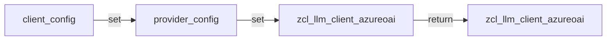
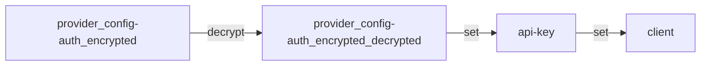
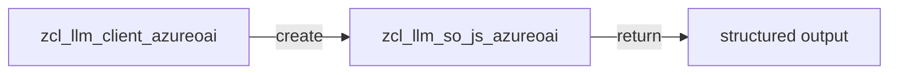
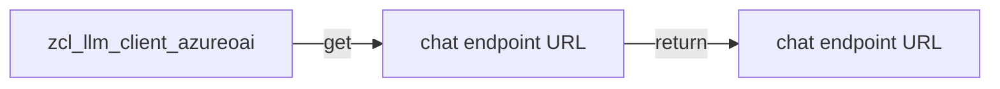

# Class ZCL_LLM_CLIENT_AZUREOAI

AI Generated documentation.
## Overview
The `zcl_llm_client_azureoai` class is a subclass of `zcl_llm_client_base` and provides a factory method `get_client` to create a new instance of the Azure OpenAI client. The class is responsible for initializing the client with the provided configuration and handling authentication.

## Dependencies
The class depends on the following:

* `zcl_llm_client_base`: The base class that provides common functionality for all LLM clients.
* `zcl_llm_http_client_wrapper`: A class that provides a wrapper for the HTTP client.
* `zcl_llm_common`: A class that provides common functionality for LLM clients, including the `get_llm_badi` function.
* `zcl_llm_so_js_azureoai`: A class that provides a structured output for the Azure OpenAI API.

## Details
### Factory Method `get_client`
The `get_client` method creates a new instance of the `zcl_llm_client_azureoai` class and initializes it with the provided `client_config` and `provider_config`. The method returns the created client instance.

### Method `set_auth`
The `set_auth` method is responsible for setting the authentication for the client. It checks if the `provider_config-auth_encrypted` field is set and if so, it decrypts the value using the `get_encryption_impl` function from the `zcl_llm_common` class. If the `provider_config-auth_type` is set to 'A', it sets the `api-key` header with the decrypted value.

### Method `create_structured_output`
The `create_structured_output` method creates a new instance of the `zcl_llm_so_js_azureoai` class and returns it.

### Method `get_chat_endpoint`
The `get_chat_endpoint` method returns the URL for the chat endpoint of the Azure OpenAI API.

