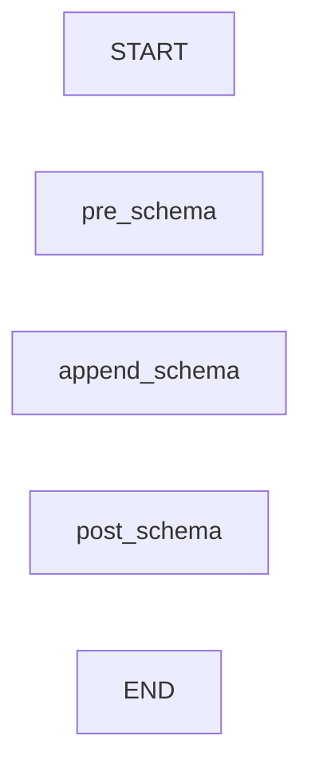

# Class ZCL_LLM_SO_JS_OA

AI Generated documentation.
## Overview
The `zcl_llm_so_js_oa` class is an extension of the `zcl_llm_so_js` class, providing a specialized implementation for OpenAI JSON Schema. It inherits from the parent class and adds new functionality to the existing schema generation process.

The class has two public methods: `pre_schema` and `post_schema`. These methods are used to append specific schema definitions to the existing schema.

## Dependencies
None

## Details
### Interaction with Parent Class
The `zcl_llm_so_js_oa` class inherits from `zcl_llm_so_js`, which is not shown in the provided code snippet. However, based on the `pre_schema` and `post_schema` methods, it can be inferred that the parent class provides some common schema generation functionality.

```mermaid
graph LR
    zcl_llm_so_js ->> zcl_llm_so_js_oa: schema
    zcl_llm_so_js_oa -->|append_schema|> zcl_llm_so_js: schema
```

### Logic Flow
The `pre_schema` method appends a specific schema definition to the existing schema, indicating that the OpenAI JSON Schema implementation is being used. The `post_schema` method appends another schema definition, likely to complete the schema generation process.



### Interaction with External Objects
The class does not interact with any external objects such as function modules or tables. The schema generation process appears to be self-contained within the class.

