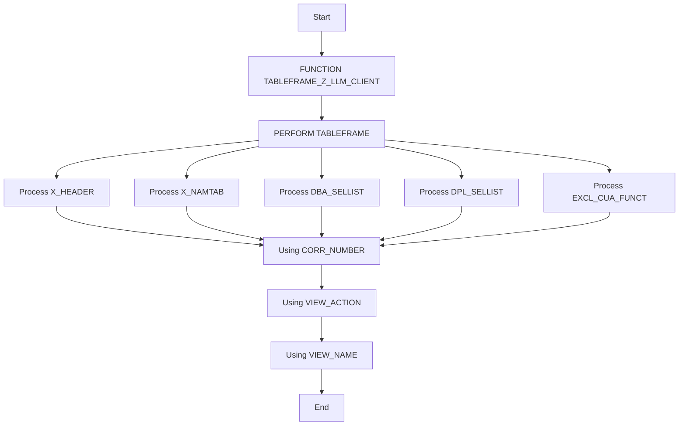

# Function Module TABLEFRAME_Z_LLM_CLIENT

AI Generated documentation.

## Overview

The function module `TABLEFRAME_Z_LLM_CLIENT` is designed to generate a table frame for a specific client within the SAP system. The primary functionality involves performing a series of operations encapsulated within the `TABLEFRAME` perform statement. This perform statement processes various tables and parameters, including `X_HEADER`, `X_NAMTAB`, `DBA_SELLIST`, `DPL_SELLIST`, and `EXCL_CUA_FUNCT`. The function module utilizes the parameters `CORR_NUMBER`, `VIEW_ACTION`, and `VIEW_NAME` to execute its operations.

## Dependencies

No dependencies are explicitly listed in the provided code.

## Details

The function module `TABLEFRAME_Z_LLM_CLIENT` performs a single `PERFORM` statement that calls the `TABLEFRAME` subroutine. This subroutine is responsible for handling the table frame generation process. The subroutine processes multiple tables and parameters, which are passed to it as arguments.

The logic flow of the function module can be visualized as follows:

The `TABLEFRAME` subroutine is called with the following parameters:

- `X_HEADER`: A table containing header information.
- `X_NAMTAB`: A table containing name information.
- `DBA_SELLIST`: A table containing database selection list information.
- `DPL_SELLIST`: A table containing display selection list information.
- `EXCL_CUA_FUNCT`: A table containing exclusion criteria for CUA functions.
- `CORR_NUMBER`: A parameter used for correlation purposes.
- `VIEW_ACTION`: A parameter specifying the action to be performed on the view.
- `VIEW_NAME`: A parameter specifying the name of the view.

The subroutine processes these parameters to generate the table frame for the specified client. The exact details of the processing logic within the `TABLEFRAME` subroutine are not provided in the given code, but it is clear that the subroutine plays a crucial role in the functionality of the function module.
