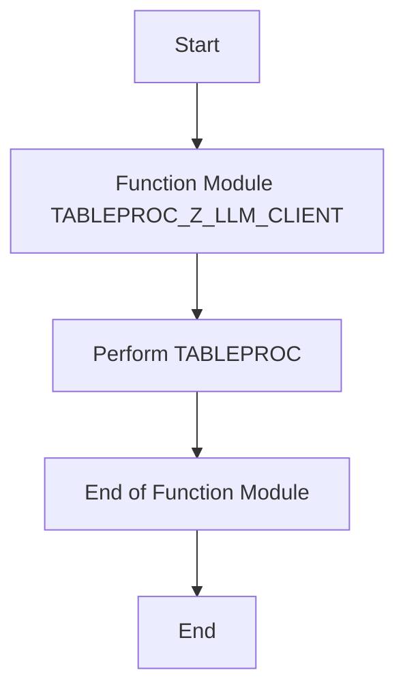

# Function Module TABLEPROC_Z_LLM_CLIENT

AI Generated documentation.

## Overview

The function module `TABLEPROC_Z_LLM_CLIENT` is designed to handle table processing for a specific client-related logic. The main functionality of this module is encapsulated within the `TABLEPROC` perform statement. This perform statement likely calls a subroutine or a set of subroutines that execute the necessary table processing logic.

## Dependencies

There are no explicit dependencies listed in the provided code. However, the `TABLEPROC` perform statement suggests that there might be a subroutine or a set of subroutines defined elsewhere in the codebase that this function module relies on.

## Details

The function module `TABLEPROC_Z_LLM_CLIENT` is a straightforward module that primarily calls a subroutine named `TABLEPROC`. This subroutine is responsible for the actual table processing logic. Below is a Mermaid diagram to visualize the flow of the function module:

### Key Points

1. **Function Module Initialization**: The function module `TABLEPROC_Z_LLM_CLIENT` is initialized with a standard header that includes metadata such as the program name, generation date, and version information.
2. **Perform Statement**: The core functionality is handled by the `PERFORM TABLEPROC` statement. This statement calls a subroutine named `TABLEPROC`, which is expected to contain the logic for processing the table.
3. **End of Function Module**: The function module concludes with the `ENDFUNCTION` statement, marking the end of the function module definition.

### Assumptions

- The `TABLEPROC` subroutine is defined elsewhere in the codebase and contains the actual logic for table processing.
- The function module is part of a larger application or system that handles client-related data and processes.

### Potential Enhancements

- **Error Handling**: Adding error handling mechanisms to manage exceptions or errors that might occur during the table processing.
- **Logging**: Implementing logging to track the execution flow and any issues that arise during the processing.
- **Documentation**: Providing detailed documentation for the `TABLEPROC` subroutine to ensure clarity and maintainability.

This overview provides a high-level understanding of the function module's purpose and its interaction with the `TABLEPROC` subroutine. For a more detailed understanding, the implementation of the `TABLEPROC` subroutine would need to be reviewed.
