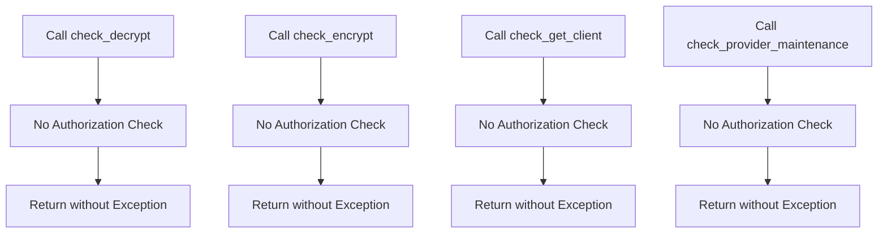

# Class ZCL_LLM_AUTH_DISABLED

AI Generated documentation.

## Overview

The `zcl_llm_auth_disabled` class is designed to implement a custom authorization check mechanism for various operations related to encryption, decryption, client retrieval, and provider maintenance. This class is a final class, meaning it cannot be inherited, and it implements the `zif_llm_auth` interface. The primary purpose of this class is to ensure that specific authorization checks do not raise exceptions when authorization is disabled.

The class provides the following public methods:

- `check_decrypt`: Checks the authorization for decryption operations.
- `check_encrypt`: Checks the authorization for encryption operations.
- `check_get_client`: Checks the authorization for retrieving client information.
- `check_provider_maintenance`: Checks the authorization for provider maintenance operations.

Each of these methods is designed to raise a `zcx_llm_authorization` exception if the operation is not allowed, but in this implementation, they are left empty, indicating that no authorization checks are performed.

## Dependencies

The class depends on the `zif_llm_auth` interface, which it implements. Additionally, it is expected to interact with the BADI `ZLLM_DEFAULTS` for custom implementations and exception handling.

## Details

The `zcl_llm_auth_disabled` class is structured to handle authorization checks for various operations in a way that ensures no exceptions are raised when authorization is disabled. This is achieved by implementing the methods from the `zif_llm_auth` interface and leaving them empty, effectively bypassing any authorization checks.

### Method Details

#### `check_decrypt`

This method is intended to check the authorization for decryption operations. In the current implementation, it does not perform any checks and simply returns without raising an exception.

#### `check_encrypt`

This method is intended to check the authorization for encryption operations. Similar to `check_decrypt`, it does not perform any checks and simply returns without raising an exception.

#### `check_get_client`

This method is intended to check the authorization for retrieving client information. It takes a parameter (e.g., `'TEST'`) and does not perform any checks, returning without raising an exception.

#### `check_provider_maintenance`

This method is intended to check the authorization for provider maintenance operations. It does not perform any checks and simply returns without raising an exception.

### Interaction with BADI `ZLLM_DEFAULTS`

The class is designed to be registered in the BADI `ZLLM_DEFAULTS`, allowing for custom implementations of the authorization checks. This registration is crucial for integrating the class into the broader system and ensuring that the custom authorization logic is applied correctly.

### Logic Flow

The following Mermaid diagram illustrates the logic flow of the class methods:

This diagram shows that each method call results in a return without performing any authorization checks, ensuring that no exceptions are raised.
