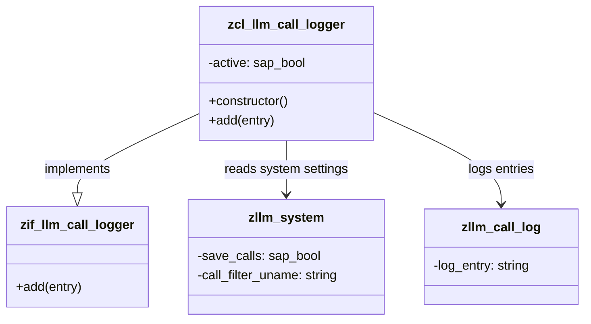

# Class ZCL_LLM_CALL_LOGGER

AI Generated documentation.

## Overview

The `zcl_llm_call_logger` class is designed to log call entries based on the system's active state and user filter settings. It implements the `zif_llm_call_logger` interface and provides a constructor to initialize the system settings. The class has a public method `add` that logs entries if the system is active and the user filter matches the current user.

## Dependencies

The class depends on the following:

- Interface: `zif_llm_call_logger`
- Table: `zllm_system`
- Table: `zllm_call_log`

## Details

The `zcl_llm_call_logger` class interacts with the `zllm_system` table to determine if the system is active and whether the user filter matches the current user. The class uses the `zllm_call_log` table to store log entries.

### Class Structure and Logic Flow

### Constructor

The constructor initializes the `active` attribute based on the system settings:

- It reads the `zllm_system` table to get the `save_calls` and `call_filter_uname` values.
- If `save_calls` is `true` and the `call_filter_uname` matches either '*' or the current user (`sy-uname`), the `active` attribute is set to `true`.

### `add` Method

The `add` method logs an entry if the system is active:

- It checks the `active` attribute.
- If `active` is `false`, the method returns immediately.
- If `active` is `true`, it inserts the log entry into the `zllm_call_log` table.

### Test Cases

The class is tested using a series of methods that set up the environment, add log entries, and verify the logging behavior:

- **`add_when_active`**: Verifies that an entry is logged when the system is active.
- **`add_when_inactive`**: Verifies that no entry is logged when the system is inactive.
- **`add_with_user_filter`**: Verifies that an entry is logged only for a specific user when the user filter is set.

### Interaction with Tables

- **`zllm_system`**: Used to determine the system's active state and user filter.
- **`zllm_call_log`**: Used to store log entries.

### Important Aspects

- The class ensures that log entries are only added when the system is active and the user filter matches the current user.
- The `active` attribute is a key factor in determining whether log entries are added.
- The class provides a clear and concise way to manage logging based on system settings and user filters.
