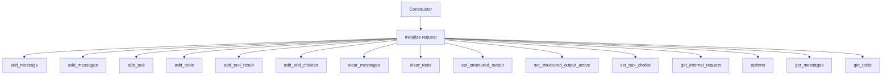

# Class ZCL_LLM_CHAT_REQUEST

AI Generated documentation.

## Overview

The `zcl_llm_chat_request` class is designed to manage chat requests, including adding and clearing messages, tools, and tool results. It implements the `zif_llm_chat_request` interface and provides a comprehensive set of methods to handle various aspects of a chat request. The class is particularly useful for managing interactions within a chat system, ensuring that messages, tools, and tool results are correctly added, cleared, and retrieved.

### Public Methods

- **add_choice**: Adds a choice to the chat request.
- **add_tool_result**: Adds a tool result to the chat request.
- **add_message**: Adds a single message to the chat request.
- **add_messages**: Adds multiple messages to the chat request.
- **add_tool**: Adds a single tool to the chat request.
- **add_tools**: Adds multiple tools to the chat request.
- **clear_messages**: Clears all messages from the chat request.
- **clear_tools**: Clears all tools from the chat request.
- **get_messages**: Retrieves all messages from the chat request.
- **get_tools**: Retrieves all tools from the chat request.
- **set_structured_output**: Sets the structured output schema and description.
- **set_structured_output_active**: Sets the structured output active flag.
- **set_tool_choice**: Sets the tool choice for the chat request.
- **get_internal_request**: Retrieves the internal request object.
- **options**: Retrieves the options of the chat request.
- **add_tool_choices**: Adds tool choices to the chat request.
- **constructor**: Initializes the chat request with a given request object.

## Dependencies

The class depends on the `zif_llm_chat_request` interface and the `zllm_request` type. It also interacts with the `zif_llm_client` and `zcl_llm_common` classes for role definitions and JSON conversion, respectively.

## Details

The `zcl_llm_chat_request` class is designed to handle the intricacies of a chat request, ensuring that messages, tools, and tool results are managed efficiently. The class uses a protected section to store the internal request object, which is initialized via the constructor. The methods in the class interact with this internal request object to perform various operations.

### Interaction Flow

The following Mermaid diagram illustrates the interaction flow within the `zcl_llm_chat_request` class:

### Key Aspects

- **Message Management**: The class provides methods to add, clear, and retrieve messages, ensuring that the chat request can handle multiple messages efficiently.
- **Tool Management**: Tools can be added, cleared, and retrieved, allowing for dynamic tool management within the chat request.
- **Tool Result Management**: Tool results can be added to the chat request, ensuring that the results of tool executions are properly recorded.
- **Structured Output**: The class supports setting and activating structured output, which is useful for formatting the chat request output in a structured manner.
- **Tool Choices**: Tool choices can be added to the chat request, allowing for flexible tool selection during the chat interaction.

This class is a crucial component in a chat system, providing a robust framework for managing chat requests and ensuring that all interactions are handled efficiently and correctly.
