# Class ZCL_LLM_CLIENT_BASE

AI Generated documentation.

## Overview

The `zcl_llm_client_base` class is an abstract base class designed to provide a foundation for LLM (Large Language Model) clients. It implements the `zif_llm_client` interface and defines a set of public methods that must be implemented by derived classes. The class handles the construction of HTTP requests, processing of HTTP responses, and managing tool calls. It also includes methods for initializing the client, setting authentication, and handling structured output.

### Public Methods

- **Constructor**: Initializes the client with the provided configuration and sets up necessary components.
- **get_http_client**: Abstract method to be implemented by derived classes to get the HTTP client.
- **set_auth**: Abstract method to be implemented by derived classes to set authentication.
- **get_chat_endpoint**: Abstract method to be implemented by derived classes to get the chat endpoint.
- **build_request_json**: Constructs the JSON request payload from the given request object.
- **handle_http_response**: Processes the HTTP response and handles errors, tool calls, and structured output.
- **parse_message**: Converts a message object into a JSON string.
- **create_structured_output**: Creates a structured output object.
- **parse_structured_output**: Parses the structured output from a JSON string.
- **handle_tool_calls**: Handles tool calls in the response and updates the result.
- **initialize**: Initializes the client by setting up the HTTP client and authentication.
- **chat**: Executes a chat request, handles the response, and updates statistics.
- **new_request**: Creates a new request object with default options and structured output.
- **get_client**: Retrieves the client instance using the provider's class.

## Dependencies

- **zif_llm_client**: Interface that defines the methods to be implemented by the LLM client.
- **zif_llm_http_client_wrapper**: Interface for the HTTP client wrapper.
- **zif_llm_tool_parser**: Interface for parsing tool details.
- **zif_llm_statistics**: Interface for handling statistics.
- **zllm_clnt_config**: Configuration type for the client.
- **zllm_providers**: Configuration type for the provider.
- **zllm_request**: Type for the request object.
- **zllm_response**: Type for the response object.
- **zllm_msg**: Type for the message object.
- **zllm_so**: Type for the structured output.
- **zcx_llm_validation**: Exception for validation errors.
- **zcx_llm_authorization**: Exception for authorization errors.
- **zcx_llm_http_error**: Exception for HTTP errors.
- **zcl_llm_tool_parser**: Class for parsing tool details.
- **zcl_llm_common**: Class for common utility methods.
- **zcl_llm_so_js**: Class for structured output in JSON format.
- **zcl_llm_chat_request**: Class for chat request.
- **zcl_llm_options**: Class for request options.
- **zif_llm_chat_request**: Interface for chat request.
- **zif_llm_tool**: Interface for tool details.

## Details

### Class Structure

The class is structured into three main sections: public, protected, and private. The public section defines the interface methods and additional methods for handling requests and responses. The protected section includes constants, type definitions, and data declarations. The private section is not used in this class.

### Interaction Flow

The following diagram illustrates the interaction flow between the main methods and components of the `zcl_llm_client_base` class:

```mermaid
graph TD
    A[Constructor] --> B[Initialize Components]
    B --> C[Set Client Config]
    B --> D[Set Provider Config]
    B --> E[Create Tool Parser]
    B --> F[Generate UUID]
    B --> G[Get Statistics]

    H[chat] --> I[Set URL]
    H --> J[Build Request JSON]
    H --> K[Communicate with Client]
    H --> L[Handle HTTP Response]
    H --> M[Update Statistics]

    N[new_request] --> O[Initialize Options]
    N --> P[Create Structured Output]
    N --> Q[Set Default Parameters]
    N --> R[Create Chat Request]

    S[handle_http_response] --> T[Check HTTP Status]
    S --> U[Parse JSON Response]
    S --> V[Handle Tool Calls]
    S --> W[Parse Structured Output]

    X[handle_tool_calls] --> Y[Loop Through Tools]
    X --> Z[Parse Tool Calls]
    X --> AA[Handle Tool Call Errors]

    BB[build_request_json] --> CC[Add Messages]
    BB --> DD[Add Structured Output]
    BB --> EE[Add Tools]
    BB --> FF[Add Options]

    GG[parse_message] --> HH[Check for Tool Calls]
    GG --> II[Format Message]
```

### Key Components

- **Constants**: Define standard HTTP status codes for OK, too many requests, and timeout.
- **Types**: Define structures for function, tool call, message, choice, usage, and response.
- **Data**: Include references to the HTTP client, client configuration, provider configuration, tool parser, statistics, timestamps, and UUID.
- **Abstract Methods**: Define methods that must be implemented by derived classes for getting the HTTP client, setting authentication, and getting the chat endpoint.
- **Common Methods**: Provide default implementations for building request JSON, handling HTTP responses, parsing messages, creating structured output, and handling tool calls.
- **Helper Methods**: Include methods for initializing the client and handling tool calls.

### Error Handling

The class includes robust error handling mechanisms, such as checking HTTP status codes, handling tool call errors, and catching exceptions. This ensures that the client can gracefully handle various error scenarios and provide meaningful error messages.
