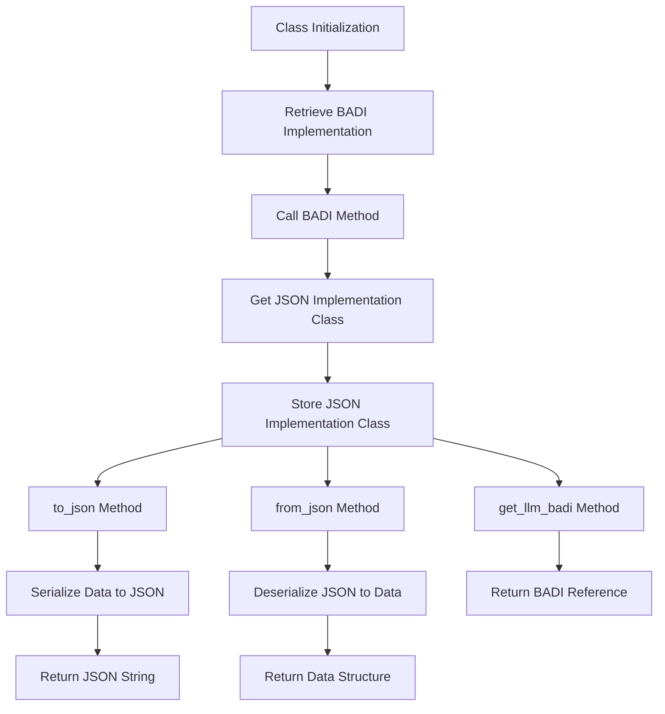

# Class ZCL_LLM_COMMON

AI Generated documentation.

## Overview

The `zcl_llm_common` class is designed to handle the serialization and deserialization of data structures to and from JSON format. It provides public methods for converting data structures to JSON strings and vice versa. The class also includes methods for interacting with a Business Add-In (BADI) to retrieve the JSON implementation class.

### Public Methods

1. **class_constructor**: Initializes the class by retrieving the JSON implementation class from a BADI.
2. **to_json**: Converts a data structure to a JSON string. It accepts a data structure and an optional compression flag.
3. **from_json**: Converts a JSON string back to a data structure.
4. **get_llm_badi**: Returns the reference to the BADI implementation.

## Dependencies

The class depends on the following:

- **BADI `llm_badi`**: Used to retrieve the JSON implementation class.
- **Class `json_class`**: The class responsible for serialization and deserialization of JSON.

## Details

The `zcl_llm_common` class leverages the BADI `llm_badi` to dynamically retrieve the JSON implementation class during its initialization. This allows for flexible and modular JSON handling. The class methods `to_json` and `from_json` utilize the `json_class` for serialization and deserialization, respectively.

### Logic Flow

The following Mermaid diagram illustrates the interaction and logic flow within the class:

### Interaction with Foreign Objects

- **BADI `llm_badi`**: The class interacts with the BADI to get the JSON implementation class. This interaction is crucial for the dynamic retrieval of the serialization and deserialization logic.
- **Class `json_class`**: This class is responsible for the actual serialization and deserialization of data. It is dynamically assigned during the class initialization and used in the `to_json` and `from_json` methods.

### Important Aspects

- **Dynamic JSON Handling**: The class uses a BADI to dynamically retrieve the JSON implementation class, making it flexible and adaptable to different JSON handling requirements.
- **Serialization and Deserialization**: The core functionality revolves around converting data structures to JSON strings and vice versa, ensuring data can be easily exchanged and stored in a standardized format.
- **Compression Option**: The `to_json` method includes an optional compression flag, allowing for compact JSON strings when needed.
