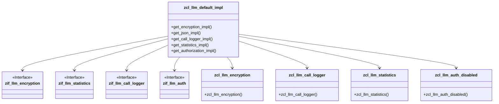
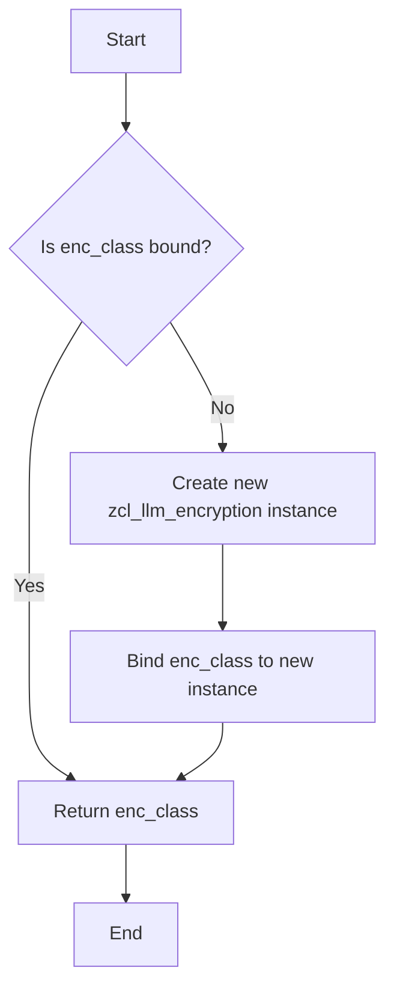

# Class ZCL_LLM_DEFAULT_IMPL

AI Generated documentation.

## Overview

The `zcl_llm_default_impl` class is a public implementation class that provides default implementations for various interfaces. It serves as a central point for managing different functionalities related to encryption, JSON handling, call logging, statistics, and authorization. The class adheres to the Singleton pattern, ensuring that only one instance of each managed class is created.

### Public Methods

- **`get_encryption_impl`**: Returns an instance of the encryption class. If the instance is not already created, it initializes a new instance of `zcl_llm_encryption`.
- **`get_json_impl`**: Returns a constant string representing the JSON class.
- **`get_call_logger_impl`**: Returns an instance of the call logger class. If the instance is not already created, it initializes a new instance of `zcl_llm_call_logger`.
- **`get_statistics_impl`**: Returns an instance of the statistics class. If the instance is not already created, it initializes a new instance of `zcl_llm_statistics`.
- **`get_authorization_impl`**: Returns an instance of the authorization class. If the instance is not already created, it initializes a new instance of `zcl_llm_auth_disabled`.

## Dependencies

The class depends on the following interfaces and classes:

- `if_badi_interface`
- `zif_llm_default_impl`
- `zif_llm_encryption`
- `zif_llm_statistics`
- `zif_llm_call_logger`
- `zif_llm_auth`
- `zcl_llm_encryption`
- `zcl_llm_call_logger`
- `zcl_llm_statistics`
- `zcl_llm_auth_disabled`

## Details

The class utilizes the Singleton pattern to manage instances of the dependent classes. This ensures that only one instance of each class is created and reused throughout the application. The following diagram illustrates the interaction between the `zcl_llm_default_impl` class and its dependent classes:

### Singleton Pattern Implementation

The class ensures that each dependent class is instantiated only once. This is achieved by checking if the class instance is already bound before creating a new instance. The following diagram illustrates the logic flow for the `get_encryption_impl` method, which is representative of the other methods:

This pattern is applied consistently across all methods that return instances of dependent classes, ensuring efficient memory usage and consistent behavior throughout the application.
