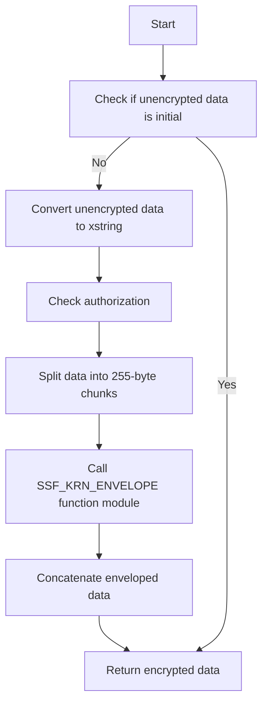
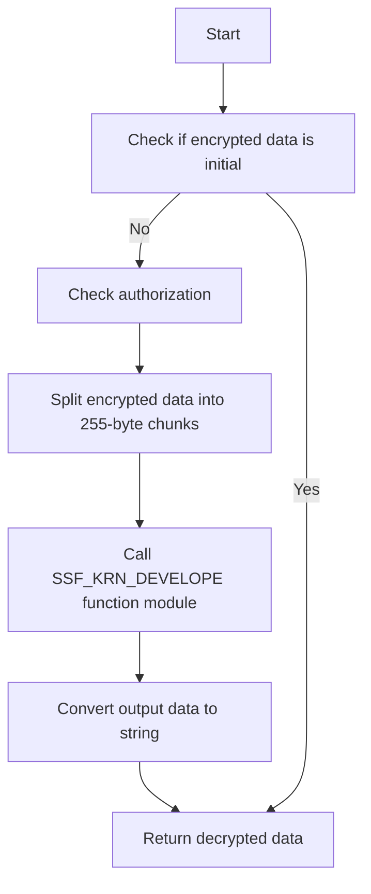

# Class ZCL_LLM_ENCRYPTION

AI Generated documentation.

## Overview

The `zcl_llm_encryption` class is designed to handle encryption and decryption operations using the SSF (Secure Storage Facility) framework in SAP. The class implements the `zif_llm_encryption` interface and provides methods for encrypting and decrypting data. The primary public methods include `encrypt` and `decrypt`, which are used to perform the encryption and decryption operations, respectively. The class also includes a `class_constructor` method that initializes the necessary components for encryption and decryption.

## Dependencies

The class depends on several SAP function modules and interfaces:

- `zif_llm_encryption`: Interface that defines the encryption and decryption methods.
- `zif_llm_auth`: Interface for authorization checks.
- `SSF_KRN_DEVELOPE`: Function module used for decrypting data.
- `SSF_KRN_ENVELOPE`: Function module used for encrypting data.
- `SSFPSE_FILENAME`: Function module used to get the profile filename.
- `SSFC_GET_CERTIFICATE`: Function module used to get the certificate.
- `SSFC_PARSE_CERTIFICATE`: Function module used to parse the certificate.

## Details

The `zcl_llm_encryption` class interacts with various SAP function modules and handles encryption and decryption using the SSF framework. Below is a detailed breakdown of the class's internal workings and interactions:

### Class Structure

The class is divided into three sections: `PUBLIC`, `PROTECTED`, and `PRIVATE`.

- **PUBLIC Section**:
  - **Methods**:
    - `class_constructor`: Initializes the encryption object, including setting up the authorization class and retrieving the necessary profile and certificate.
    - `encrypt`: Encrypts the given unencrypted data.
    - `decrypt`: Decrypts the given encrypted data.

- **PROTECTED Section**:
  - **Class Data**:
    - `subject`: Stores the subject of the encryption.
    - `addrbook`: Stores the address book profile.
    - `auth_class`: Reference to the authorization class.
  - **Constants**:
    - `application`: Application identifier.
    - `bin_line`: Size of the binary line (255 bytes).

- **PRIVATE Section**:
  - No additional data or methods are defined in this section.

### Encryption and Decryption Flow

The encryption and decryption processes involve several steps, including authorization checks, data conversion, and interaction with SSF function modules. Below is a Mermaid diagram illustrating the flow of the `encrypt` method:

### Decryption Flow

The decryption process is similar but involves the `SSF_KRN_DEVELOPE` function module. Below is a Mermaid diagram illustrating the flow of the `decrypt` method:

### Error Handling

The class includes robust error handling for various scenarios, such as memory issues, invalid parameters, and function module errors. Exceptions are raised using the `zcx_llm_validation` class, with specific text IDs and attributes to indicate the nature of the error.

### Authorization

The `class_constructor` method initializes the authorization class by calling the `get_authorization_impl` method of the `llm_badi` BAdI (Business Add-In). This ensures that the encryption and decryption operations are performed with the necessary permissions.

### Profile and Certificate Management

The class retrieves the profile and certificate using the `SSFPSE_FILENAME`, `SSFC_GET_CERTIFICATE`, and `SSFC_PARSE_CERTIFICATE` function modules. These steps are crucial for setting up the encryption environment and ensuring that the correct certificate is used for encryption and decryption operations.

This detailed overview provides a comprehensive understanding of the `zcl_llm_encryption` class, its interactions, and its internal workings.
