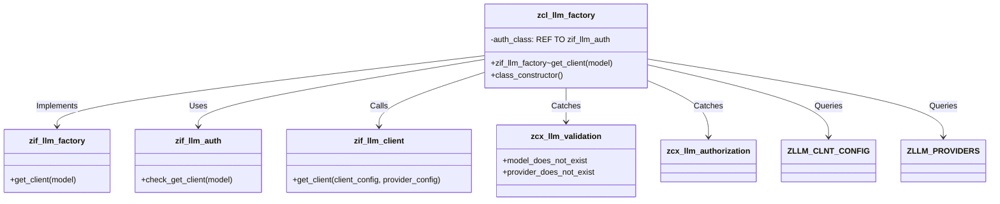

# Class ZCL_LLM_FACTORY

AI Generated documentation.

## Overview

The `zcl_llm_factory` class is designed to manage the creation and validation of clients for Large Language Models (LLMs). It provides a public interface for obtaining client configurations and handles various validation and authorization checks. The class interacts with database tables to retrieve necessary configurations and ensures that the correct exceptions are raised for invalid inputs.

### Public Methods

- **`zif_llm_factory~get_client`**: This method is the core functionality of the class. It checks the authorization for getting a client, retrieves the client configuration from the `ZLLM_CLNT_CONFIG` table, and then retrieves the provider configuration from the `ZLLM_PROVIDERS` table. If any of these steps fail, it raises appropriate exceptions. Finally, it calls the provider class to get the client.
- **`class_constructor`**: This method initializes the class by obtaining the authorization implementation from a Business Add-In (BADI).

## Dependencies

- **Interfaces**: `zif_llm_factory`, `zif_llm_auth`, `zif_llm_client`
- **Exceptions**: `zcx_llm_validation`, `zcx_llm_authorization`
- **Database Tables**: `ZLLM_CLNT_CONFIG`, `ZLLM_PROVIDERS`
- **Classes**: `zcl_llm_common`

## Details

The `zcl_llm_factory` class is responsible for ensuring that clients are created and validated correctly. The class interacts with several components to achieve this:

### Logic Flow

The logic flow of the `zif_llm_factory~get_client` method can be visualized as follows:

```mermaid
graph TD
    A[Start] --> B[Check Authorization]
    B --> C[Retrieve Client Configuration]
    C --> D{Client Configuration Found?}
    D -- Yes --> E[Retrieve Provider Configuration]
    D -- No --> F[Raise zcx_llm_validation (model_does_not_exist)]
    E --> G{Provider Configuration Found?}
    G -- Yes --> H[Call Provider Class to Get Client]
    G -- No --> I[Raise zcx_llm_validation (provider_does_not_exist)]
    H --> J[End]
    F --> J
    I --> J
```

### Interaction with Foreign Objects

The class interacts with several foreign objects, including interfaces, exceptions, and database tables. The main interactions are as follows:

- **Interfaces**:
  - `zif_llm_factory`: Provides the public method `get_client`.
  - `zif_llm_auth`: Used for authorization checks.
  - `zif_llm_client`: Called to get the client.

- **Exceptions**:
  - `zcx_llm_validation`: Raised for validation errors such as model or provider not found.
  - `zcx_llm_authorization`: Raised for authorization errors.

- **Database Tables**:
  - `ZLLM_CLNT_CONFIG`: Stores client configurations.
  - `ZLLM_PROVIDERS`: Stores provider configurations.

### Class Diagram

The class diagram provides a visual representation of the class and its interactions:



This detailed overview provides a comprehensive understanding of the `zcl_llm_factory` class, its functionality, and its interactions with other components.
