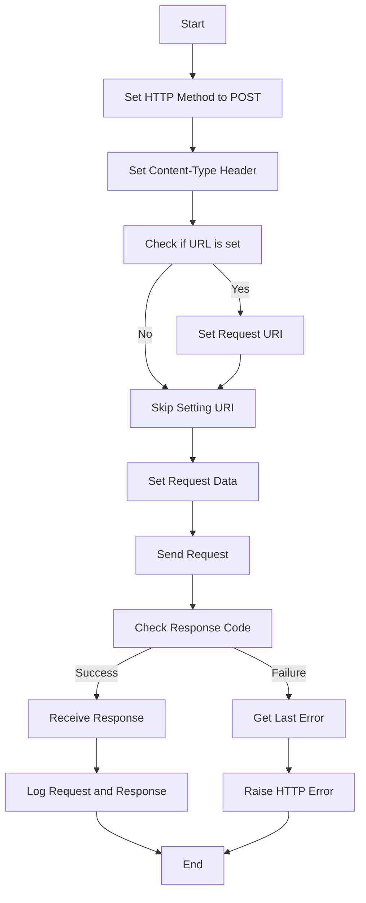

# Class ZCL_LLM_HTTP_CLIENT_WRAPPER

AI Generated documentation.

## Overview

The `zcl_llm_http_client_wrapper` class is designed to encapsulate the functionality of an HTTP client, providing a wrapper around the SAP HTTP client. This class is part of a larger system that handles HTTP communication, logging, and error handling. The class implements the `zif_llm_http_client_wrapper` interface, which defines the public methods for interacting with the HTTP client.

### Public Methods

1. **Constructor**:
   - **Purpose**: Initializes the HTTP client wrapper with the provided `client_config` and `provider_config`.
   - **Parameters**:
     - `client_config`: Configuration for the client.
     - `provider_config`: Configuration for the provider.
   - **Exceptions**: Raises `zcx_llm_validation` if there is an error during initialization.

2. **get_client**:
   - **Purpose**: Returns a new instance of the HTTP client wrapper.
   - **Parameters**: None.
   - **Returns**: A new instance of `zcl_llm_http_client_wrapper`.

3. **set_header**:
   - **Purpose**: Sets a header on the HTTP request.
   - **Parameters**:
     - `name`: The name of the header.
     - `value`: The value of the header.
   - **Returns**: None.

4. **set_url**:
   - **Purpose**: Sets the URL for the HTTP request.
   - **Parameters**:
     - `url`: The URL to be set.
   - **Returns**: None.

5. **communicate**:
   - **Purpose**: Sends an HTTP request and handles the response.
   - **Parameters**: None.
   - **Returns**: None.
   - **Exceptions**: Raises `zcx_llm_http_error` if there is an error during communication.

6. **close_client**:
   - **Purpose**: Closes the HTTP client.
   - **Parameters**: None.
   - **Returns**: None.

## Dependencies

- **zif_llm_http_client_wrapper**: Interface that defines the public methods for the HTTP client wrapper.
- **zcl_llm_common**: Provides utility methods, such as `get_llm_badi`.
- **zcx_llm_validation**: Exception class for validation errors.
- **zcx_llm_http_error**: Exception class for HTTP communication errors.
- **cl_http_client**: SAP HTTP client class.
- **cl_http_utility**: Utility class for HTTP operations.
- **zif_llm_call_logger**: Interface for logging HTTP calls.

## Details

The `zcl_llm_http_client_wrapper` class is designed to handle HTTP communication in a structured and error-resistant manner. It uses the SAP HTTP client to send and receive HTTP requests and responses. The class also includes logging functionality to record the details of each HTTP call, which is crucial for debugging and monitoring.

### Class Structure

The class is divided into three sections: public, protected, and private.

- **Public Section**: Contains the interface methods and the constructor.
- **Protected Section**: Contains data members for configuration, URL, client, and call logger.
- **Private Section**: Contains the implementation details of the methods.

### Key Interactions

1. **Initialization**:
   - The constructor initializes the client and provider configurations.
   - It retrieves the call logger implementation using a Business Add-In (BADI).
   - It creates an HTTP client using the destination specified in the provider configuration.
   - If the destination is not found or there is an error, it raises a validation exception.

2. **Header and URL Setting**:
   - The `set_header` method sets a header on the HTTP request.
   - The `set_url` method sets the URL for the HTTP request.

3. **Communication**:
   - The `communicate` method sends an HTTP POST request with a JSON content type.
   - It sets the request URI if a URL is provided.
   - It sends the request and receives the response.
   - It logs the request and response details using the call logger.
   - If there is an error during communication, it raises an HTTP error exception.

4. **Client Management**:
   - The `get_client` method returns a new instance of the HTTP client wrapper.
   - The `close_client` method closes the HTTP client, ignoring any exceptions that occur during the process.

### Logic Flow

The following Mermaid diagram illustrates the logic flow of the `communicate` method:

This diagram shows the sequence of operations performed during an HTTP communication, including setting headers, sending the request, receiving the response, and handling errors.
