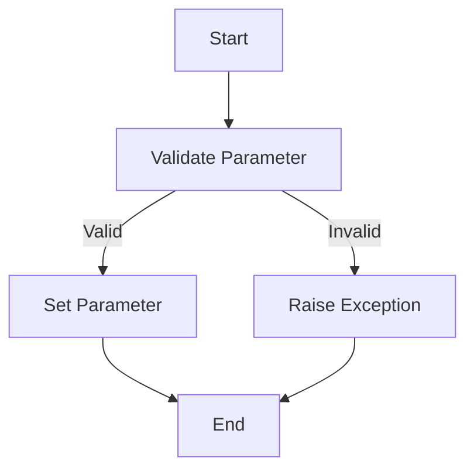
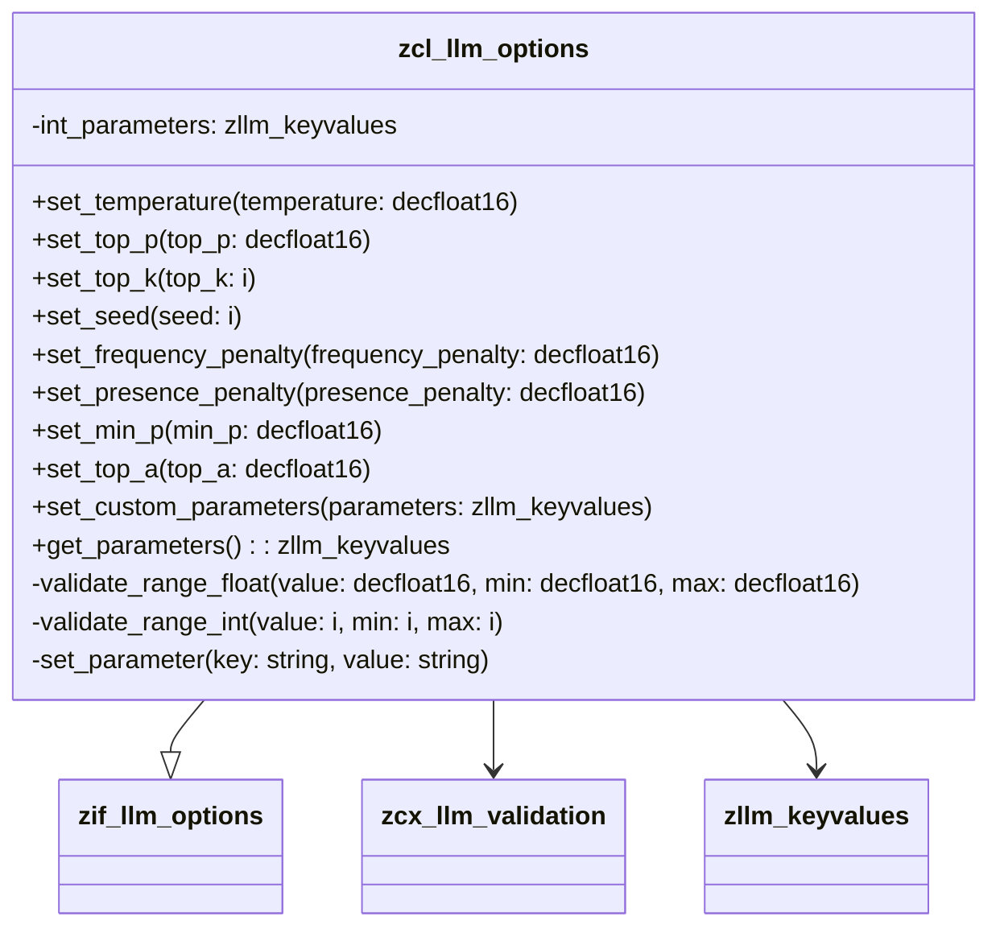

# Class ZCL_LLM_OPTIONS

AI Generated documentation.

## Overview

The `zcl_llm_options` class is designed to manage and validate various parameters for a language model. It provides a set of public methods to set and get different configuration options, ensuring that the values fall within specified ranges. The class implements the `zif_llm_options` interface, which defines the methods for setting and getting parameters.

### Public Methods

- **set_temperature**: Sets the temperature value, ensuring it falls within the range [0, 2].
- **set_top_p**: Sets the top_p value, ensuring it falls within the range [0, 1].
- **set_top_k**: Sets the top_k value, ensuring it is at least 1.
- **set_seed**: Sets the seed value, ensuring it is non-negative.
- **set_frequency_penalty**: Sets the frequency penalty value, ensuring it falls within the range [-2, 2].
- **set_presence_penalty**: Sets the presence penalty value, ensuring it falls within the range [-2, 2].
- **set_min_p**: Sets the min_p value, ensuring it falls within the range [0, 1].
- **set_top_a**: Sets the top_a value, ensuring it falls within the range [0, 1].
- **set_custom_parameters**: Sets custom parameters, allowing for multiple key-value pairs.
- **get_parameters**: Retrieves all parameters set in the class.

## Dependencies

- **zif_llm_options**: Interface that defines the methods for setting and getting parameters.
- **zcx_llm_validation**: Exception class used for validation errors.
- **zllm_keyvalues**: Internal table type used to store key-value pairs of parameters.

## Details

The `zcl_llm_options` class uses internal methods to validate and set parameters, ensuring that the values adhere to specified constraints. The class maintains a table of parameters (`int_parameters`) to store key-value pairs.

### Internal Methods

- **validate_range_float**: Validates a floating-point value to ensure it falls within a specified range.
- **validate_range_int**: Validates an integer value to ensure it falls within a specified range.
- **set_parameter**: Adds or updates a parameter in the `int_parameters` table.

### Logic Flow

The class follows a straightforward logic flow for setting parameters:

1. **Validation**: Each parameter is validated using `validate_range_float` or `validate_range_int` methods.
2. **Setting Parameter**: If the value is valid, it is set using the `set_parameter` method.
3. **Exception Handling**: If the value is invalid, an exception of type `zcx_llm_validation` is raised.

### Interaction with Foreign Objects

The class interacts with the `zif_llm_options` interface to define its public methods. It also uses the `zcx_llm_validation` exception class for validation errors and the `zllm_keyvalues` table type to store parameters.

### Mermaid Diagram: Logic Flow for Setting a Parameter

### Mermaid Diagram: Class Structure

This documentation provides a comprehensive overview of the `zcl_llm_options` class, its public methods, dependencies, and internal logic flow.
