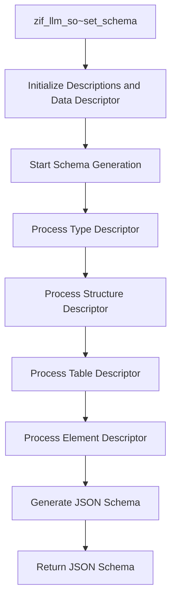

# Class ZCL_LLM_SO_JS

AI Generated documentation.

## Overview

The `zcl_llm_so_js` class is designed to generate JSON schemas from ABAP data structures. It implements the `zif_llm_so` interface and provides methods to handle various data types, including elements, structures, tables, and arrays. The class is structured to process different types of data descriptors and generate corresponding JSON schema representations.

### Public Methods

- **`zif_llm_so~get_datatype`**: Returns the data descriptor.
- **`zif_llm_so~get_schema`**: Returns the generated JSON schema.
- **`zif_llm_so~set_schema`**: Sets the schema and initializes the process to generate the JSON schema.

## Dependencies

The class depends on the following:

- **`zif_llm_so`**: Interface that defines the methods for schema generation.
- **`cl_abap_typedescr`**: Class for type descriptors in ABAP.
- **`cl_abap_structdescr`**: Class for structure descriptors in ABAP.
- **`cl_abap_tabledescr`**: Class for table descriptors in ABAP.
- **`cl_abap_elemdescr`**: Class for element descriptors in ABAP.
- **`cl_abap_datadescr`**: Class for data descriptors in ABAP.
- **`cl_abap_format`**: Class for formatting in ABAP.
- **`zcx_llm_validation`**: Exception class for validation errors.

## Details

The class `zcl_llm_so_js` is designed to handle the generation of JSON schemas from ABAP data structures. It processes different types of data descriptors and generates the corresponding JSON schema. The main interactions and logic flow can be visualized using a Mermaid diagram.

### Logic Flow



### Interaction with Foreign Objects

The class interacts with various ABAP classes to handle different types of data descriptors:

- **`cl_abap_typedescr`**: Used to determine the kind of type descriptor (structure, table, element).
- **`cl_abap_structdescr`**: Used to process structure descriptors and their components.
- **`cl_abap_tabledescr`**: Used to process table descriptors and their line types.
- **`cl_abap_elemdescr`**: Used to process element descriptors and their types.
- **`cl_abap_datadescr`**: Used to get the data descriptor for the schema generation process.
- **`cl_abap_format`**: Used for formatting JSON strings.
- **`zcx_llm_validation`**: Raised for unsupported types or invalid elements.

### Key Methods

- **`process_type`**: Determines the type of descriptor and calls the appropriate method (`process_structure`, `process_table`, `process_element`).
- **`process_structure`**: Handles structure descriptors, processes each component, and generates the JSON schema for the structure.
- **`process_table`**: Handles table descriptors, processes the line type, and generates the JSON schema for the table.
- **`process_element`**: Handles element descriptors, determines the type (integer, number, string, boolean), and generates the JSON schema for the element.
- **`append_to_schema`**: Appends content to the schema string.
- **`get_enum_values`**: Generates a string of enum values for the JSON schema.
- **`get_field_info`**: Retrieves field information based on name and path.
- **`get_path`**: Generates the path for a field.

### Error Handling

The class raises `zcx_llm_validation` exceptions for unsupported types or invalid elements. This ensures that only valid data types are processed and included in the JSON schema.

### Example Use Case

An example use case would involve setting the schema with a data descriptor and retrieving the generated JSON schema. This process involves initializing the descriptions and data descriptor, processing the type descriptor, and generating the JSON schema.

```abap
DATA: lo_schema TYPE REF TO zcl_llm_so_js,
      lo_data_desc TYPE REF TO cl_abap_datadescr,
      lv_schema TYPE string.

" Initialize data descriptor
lo_data_desc = ... " (some initialization code)

" Create schema object
CREATE OBJECT lo_schema.

" Set schema
lo_schema->set_schema( descriptions = ... data_desc = lo_data_desc ).

" Get schema
lv_schema = lo_schema->get_schema( ).
```

This overview provides a comprehensive understanding of the `zcl_llm_so_js` class, its public methods, dependencies, and detailed interactions with foreign objects.
