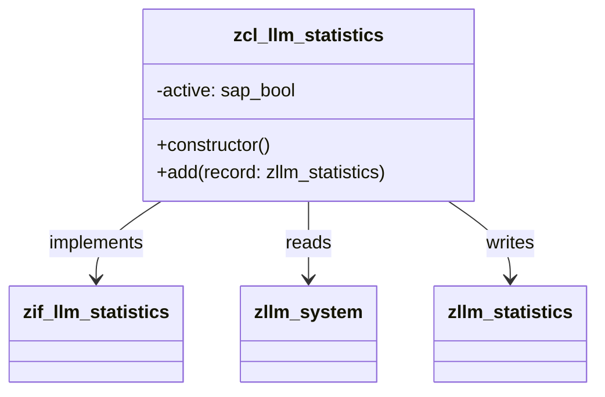
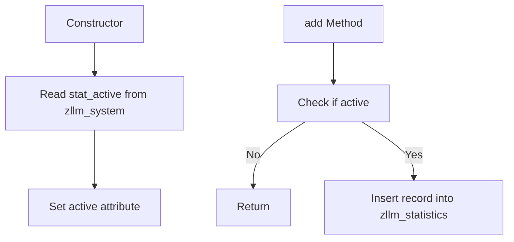

# Class ZCL_LLM_STATISTICS

AI Generated documentation.

## Overview

The `zcl_llm_statistics` class is designed to manage and add statistical data, implementing the `zif_llm_statistics` interface. The class provides a public method `add` to insert statistical records and a constructor to initialize the class with the active status from the `zllm_system` table.

### Public Methods

- **add**: This method inserts a statistical record into the `zllm_statistics` table. It checks the `active` status before performing the insertion.
- **constructor**: This method initializes the class by retrieving the `stat_active` value from the `zllm_system` table and setting the `active` attribute accordingly.

## Dependencies

- **Interface**: `zif_llm_statistics`
- **Tables**: `zllm_statistics`, `zllm_system`

## Details

The class `zcl_llm_statistics` interacts with the `zllm_system` table to determine if statistical data should be processed. The `active` attribute, which is set during the class initialization, controls whether the `add` method performs its insertion operation.

### Class Diagram

### Logic Flow

The logic flow of the `zcl_llm_statistics` class can be visualized as follows:

### Interaction with Tables

The class interacts with two main tables:

- **zllm_system**: Read operation to retrieve the `stat_active` value during class initialization.
- **zllm_statistics**: Write operation to insert statistical records when the `add` method is called and the `active` status is true.
