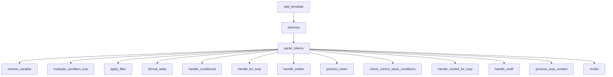

# Class ZCL_LLM_TEMPLATE_PARSER

AI Generated documentation.

## Overview

The `zcl_llm_template_parser` class is designed to parse and render templates based on a limited Jinja2-like syntax. It provides methods to add templates, render them with a given context, and handle various control structures and variable substitutions. The class is particularly useful for generating dynamic content by embedding variables and control logic within templates.

### Public Methods

1. **Constructor**:
   - Initializes the template parser with an empty list of templates.

2. **add_template**:
   - **Purpose**: Adds or replaces a template with a given name and content.
   - **Parameters**:
     - `name`: Name of the template.
     - `content`: Content of the template.
     - `replace`: Boolean flag to determine if an existing template with the same name should be replaced.
   - **Raises**: `zcx_llm_template_parser` if template parsing fails.

3. **render**:
   - **Purpose**: Renders a template with the given name using the provided context.
   - **Parameters**:
     - `template_name`: Name of the template to render.
     - `context`: Data context for variable resolution.
   - **Returns**: Rendered template string.
   - **Raises**: `zcx_llm_template_parser` if rendering fails.

## Dependencies

The class does not have any external dependencies beyond standard ABAP types and classes. It relies on internal methods and data structures to manage templates and their rendering.

## Details

### Internal Workflow

The internal workflow of the `zcl_llm_template_parser` class involves several key steps:

1. **Template Addition**:
   - Templates are added using the `add_template` method. If a template with the same name already exists and the `replace` flag is set to `true`, the existing template is replaced.

2. **Tokenization**:
   - The `tokenize` method converts the template content into a sequence of tokens. It handles different types of tokens such as text, variables, control structures, and comments.

3. **Parsing**:
   - The `parse_tokens` method processes the tokens and replaces variables with values from the provided context. It handles control structures like loops and conditionals.

4. **Variable Resolution**:
   - The `resolve_variable` method resolves variable paths to their values. It supports nested structures and table indices.

5. **Control Structures**:
   - The class handles various control structures such as `if`, `else`, `elif`, `for`, and `endfor`. These are managed using a control stack to keep track of the current state of the parsing process.

### Key Methods

1. **tokenize**:
   - Converts the template string into a sequence of tokens.
   - Handles different token types and removes comments.

2. **parse_tokens**:
   - Processes the tokens and replaces variables with values from the context.
   - Manages control structures and handles nested loops.

3. **resolve_variable**:
   - Resolves variable paths to their values.
   - Supports nested structures and table indices.

4. **evaluate_condition_true**:
   - Evaluates conditions in control structures.
   - Supports logical operators and comparison operators.

5. **apply_filter**:
   - Applies filters to variable values.
   - Supports filters like `upper`, `lower`, `capitalize`, and `default`.

6. **format_table**:
   - Formats tables as strings.
   - Supports elementary types, structures, and nested tables.

### Logic Flow

The following Mermaid diagram illustrates the logic flow of the `zcl_llm_template_parser` class:

### Interaction with Foreign Objects

The class interacts with the following foreign objects:

- **ABAP Data Types**: The class uses standard ABAP data types to define templates and tokens.
- **ABAP Classes**: The class uses internal methods and data structures to manage templates and their rendering.
- **ABAP Tables**: The class uses internal tables to store templates and tokens.

### Error Handling

The class raises exceptions of type `zcx_llm_template_parser` for various error conditions, including unclosed tokens, invalid paths, unclosed control structures, and variable resolution errors. This ensures that any issues during template parsing or rendering are properly handled and reported.
