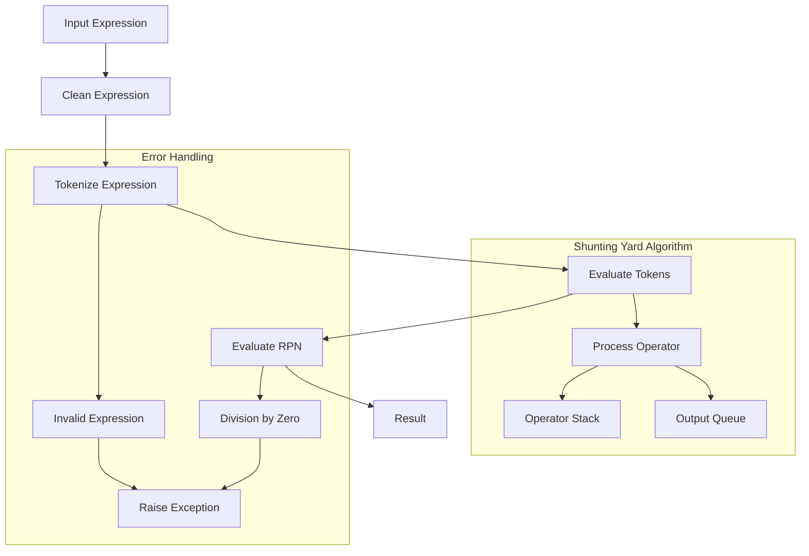

# Class ZCL_LLM_TOOL_CALCULATOR

AI Generated documentation.

## Overview

The `zcl_llm_tool_calculator` class is designed to evaluate mathematical expressions. It provides a robust interface for parsing and evaluating expressions involving addition, subtraction, multiplication, division, power, and modulo operations. The class implements the `zif_llm_tool` interface, which defines the structure and behavior of the calculator tool.

### Public Methods

1. **`get_tool_details`**: Returns details about the calculator tool, including its name, type, description, and parameters.
2. **`execute`**: Evaluates a given mathematical expression and returns the result. It handles exceptions for invalid expressions and division by zero.
3. **`get_result`**: Retrieves the result of the last executed calculation.

### Main Interactions

- **Expression Evaluation**: The class tokenizes the input expression, processes it using the Shunting Yard algorithm, and evaluates the resulting Reverse Polish Notation (RPN).
- **Error Handling**: The class raises specific exceptions for invalid expressions, division by zero, and other arithmetic errors.
- **Tool Details**: Provides metadata about the calculator tool, including its name, type, and description.

## Dependencies

The class depends on the `zif_llm_tool` interface for defining the structure and behavior of the calculator tool. It also uses standard ABAP exceptions like `cx_sy_zerodivide`, `cx_sy_arithmetic_error`, and `cx_sy_conversion_no_number` for error handling.

## Details

### Internal Methods and Logic Flow

The class employs several internal methods to handle the evaluation of mathematical expressions. Below is a detailed breakdown of the key methods and their interactions:

1. **`evaluate_expression`**:
   - Cleans the input expression by removing spaces.
   - Tokenizes the expression.
   - Evaluates the tokens to produce the final result.

2. **`tokenize`**:
   - Converts the input expression into a list of tokens, distinguishing between numbers and operators.
   - Handles special cases like negative numbers and the `MOD` operator.

3. **`get_operator_precedence`**:
   - Determines the precedence of operators for correct evaluation order.

4. **`evaluate_tokens`**:
   - Implements the Shunting Yard algorithm to convert the infix expression to RPN.
   - Evaluates the RPN expression to produce the final result.

5. **`process_operator`**:
   - Manages the operator stack during the Shunting Yard algorithm.

6. **`evaluate_rpn`**:
   - Evaluates the RPN expression using a value stack.

7. **`apply_operator`**:
   - Applies the specified operator to two operands, handling special cases like division by zero and negative exponents.

### Mermaid Diagram: Logic Flow

### Interaction with Foreign Objects

- **`zif_llm_tool` Interface**: The class implements this interface to define the calculator tool's behavior and structure.
- **ABAP Exceptions**: The class uses standard ABAP exceptions to handle errors gracefully, ensuring robust error handling.

### Data Structures

- **`calculation_input`**: Defines the input structure for the calculator, containing the expression to be evaluated.
- **`calculation_output`**: Defines the output structure, containing the result of the evaluation.
- **`token`**: Represents a token in the expression, distinguishing between numbers and operators.
- **`tokens`**: A table of tokens used during the evaluation process.

This detailed overview provides a comprehensive understanding of the `zcl_llm_tool_calculator` class, its functionality, and its interactions with other components.
