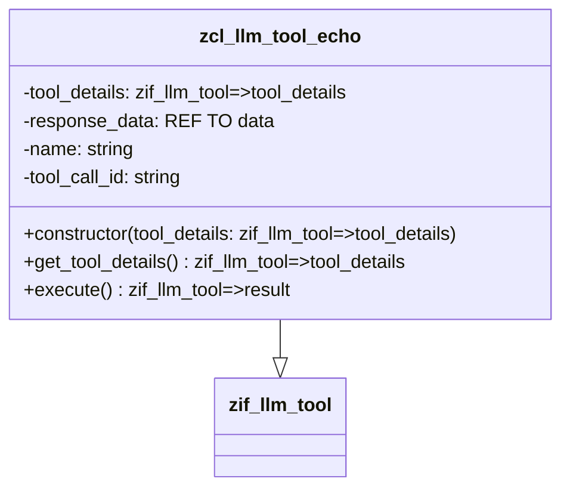
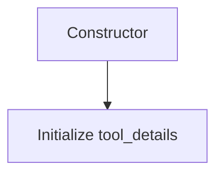
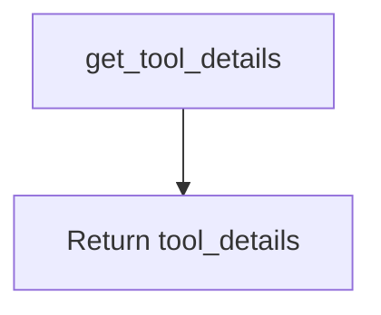
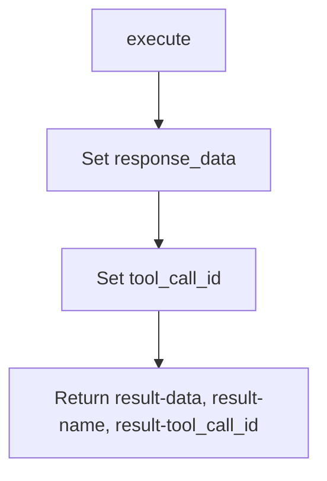

# Class ZCL_LLM_TOOL_ECHO

AI Generated documentation.

## Overview

The `zcl_llm_tool_echo` class is a final, public class that implements the `zif_llm_tool` interface. It provides functionality for handling tool details and executing operations related to a tool. The class includes the following public methods:

- **Constructor**: Initializes the class with tool details.
- **get_tool_details**: Returns the tool details.
- **execute**: Executes the tool and returns the result.

## Dependencies

The class depends on the `zif_llm_tool` interface, which defines the methods that must be implemented.

## Details

The `zcl_llm_tool_echo` class is designed to echo tool details and execute operations. The class uses the following internal data:

- `tool_details`: Stores the details of the tool.
- `response_data`: Holds the response data after execution.
- `name`: The name of the tool.
- `tool_call_id`: The ID of the tool call.

### Class Diagram

### Method Details

#### Constructor

The constructor initializes the class with the provided tool details.

#### get_tool_details

This method returns the tool details stored in the class.

#### execute

This method executes the tool and returns the result, including the response data, tool name, and tool call ID.

The `execute` method sets the `response_data` and `tool_call_id`, and then returns these values along with the tool name.
