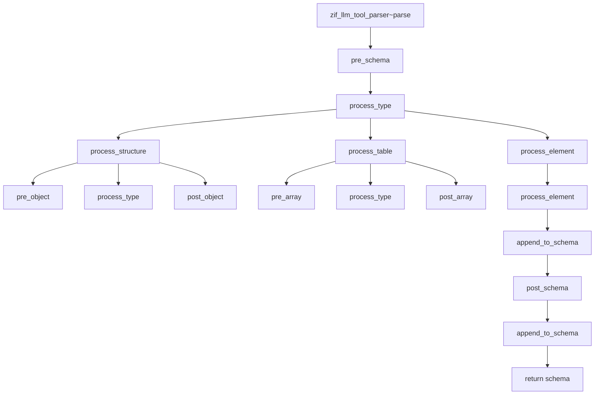

# Class ZCL_LLM_TOOL_PARSER

AI Generated documentation.

## Overview

The `zcl_llm_tool_parser` class is designed to parse various data structures and generate a JSON schema representation. This class implements the `zif_llm_tool_parser` interface and provides methods to handle different types of data structures, including single elements, simple structures, nested structures, tables, and arrays. The class is particularly useful for converting ABAP data types into a JSON schema format, which can be used for various purposes such as data validation, documentation, or integration with other systems.

### Public Methods

- **`pre_schema`**: Called before the schema generation process starts.
- **`post_schema`**: Called after the schema generation process is completed.
- **`pre_object`**: Called before processing an object.
- **`post_object`**: Called after processing an object.
- **`pre_array`**: Called before processing an array.
- **`post_array`**: Called after processing an array.
- **`process_type`**: Processes a given type descriptor and generates the corresponding JSON schema.
- **`process_structure`**: Processes a structure descriptor and generates the corresponding JSON schema.
- **`process_table`**: Processes a table descriptor and generates the corresponding JSON schema.
- **`process_element`**: Processes an element descriptor and generates the corresponding JSON schema.
- **`get_field_info`**: Retrieves field information based on the provided name and path.
- **`append_to_schema`**: Appends content to the schema string.
- **`get_path`**: Generates a path string based on the current path and field name.
- **`get_enum_values`**: Retrieves enum values from a description and formats them as a JSON string.
- **`zif_llm_tool_parser~parse`**: Main method to parse the data and generate the JSON schema.

## Dependencies

The class depends on several ABAP types and classes, including:

- `cl_abap_typedescr`: Used for type descriptors.
- `cl_abap_structdescr`: Used for structure descriptors.
- `cl_abap_tabledescr`: Used for table descriptors.
- `cl_abap_elemdescr`: Used for element descriptors.
- `zif_llm_tool_parser`: Interface that the class implements.
- `zcx_llm_validation`: Exception class used for validation errors.
- `cl_abap_format`: Used for formatting strings.

## Details

The `zcl_llm_tool_parser` class is designed to handle various data structures and convert them into a JSON schema. The class uses a series of methods to process different types of data descriptors and generate the corresponding JSON schema. The main logic flow can be visualized using the following Mermaid diagram:

### Key Aspects

1. **Type Handling**: The class handles different types of ABAP data descriptors, including structures, tables, and elements. It raises exceptions for unsupported types.
2. **Field Information**: The class retrieves and processes field information, including names, paths, and descriptions.
3. **Enum Values**: The class supports enum values and formats them correctly in the JSON schema.
4. **Schema Generation**: The class generates a JSON schema by appending content to a schema string. It ensures proper formatting and structure.
5. **Exception Handling**: The class raises exceptions for unsupported types and invalid data, ensuring robust error handling.

### Interaction with Foreign Objects

The class interacts with several ABAP classes and types to process different data structures. The main interactions include:

- **`cl_abap_typedescr`**: Used to determine the type of the data descriptor.
- **`cl_abap_structdescr`**: Used to process structure descriptors and retrieve components.
- **`cl_abap_tabledescr`**: Used to process table descriptors and retrieve table line types.
- **`cl_abap_elemdescr`**: Used to process element descriptors and retrieve type information.
- **`zif_llm_tool_parser`**: Interface methods are implemented to provide the parsing functionality.
- **`zcx_llm_validation`**: Used to raise exceptions for validation errors.

This detailed overview provides a comprehensive understanding of the `zcl_llm_tool_parser` class, its functionality, and its interactions with other ABAP components.
