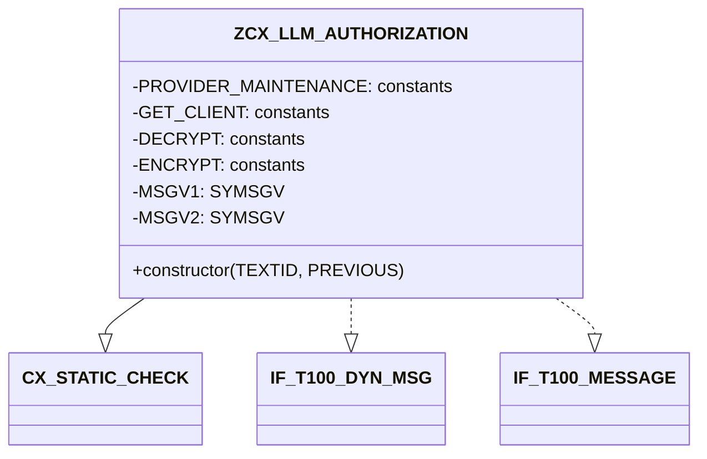
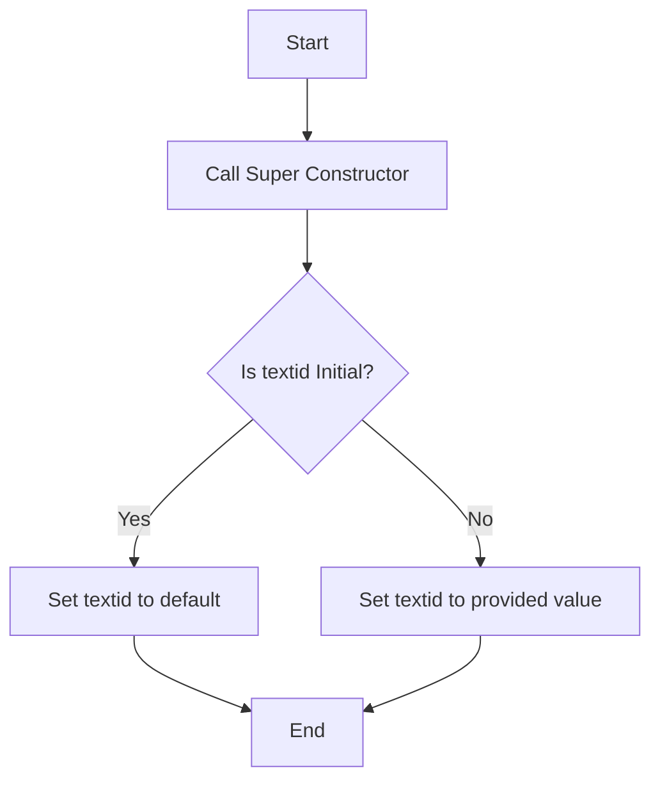

# Class ZCX_LLM_AUTHORIZATION

AI Generated documentation.

## Overview

The `ZCX_LLM_AUTHORIZATION` class is a final, public class that inherits from `CX_STATIC_CHECK`. It implements two interfaces: `IF_T100_DYN_MSG` and `IF_T100_MESSAGE`. The class is designed to handle authorization-related operations, likely within the context of a custom authorization framework. The main public method is the constructor, which initializes the object with optional parameters.

## Dependencies

The class depends on the following interfaces and classes:

- `CX_STATIC_CHECK`: The base class from which `ZCX_LLM_AUTHORIZATION` inherits.
- `IF_T100_DYN_MSG`: An interface that the class implements.
- `IF_T100_MESSAGE`: Another interface that the class implements.

## Details

The `ZCX_LLM_AUTHORIZATION` class contains several constants that define message IDs and numbers, which are likely used for error handling or logging. These constants are grouped into different categories, such as `PROVIDER_MAINTENANCE`, `GET_CLIENT`, `DECRYPT`, and `ENCRYPT`.

The class also defines two data attributes, `MSGV1` and `MSGV2`, which are of type `SYMSGV`. These attributes are likely used to store message values related to the authorization process.

The constructor method initializes the object and sets the `textid` attribute. If the `textid` parameter is not provided, it defaults to the default text ID defined in the `IF_T100_MESSAGE` interface.

The constructor method's logic can be visualized as follows:

This diagram illustrates the flow of the constructor method, showing how it initializes the object and sets the `textid` attribute based on the provided parameters.
