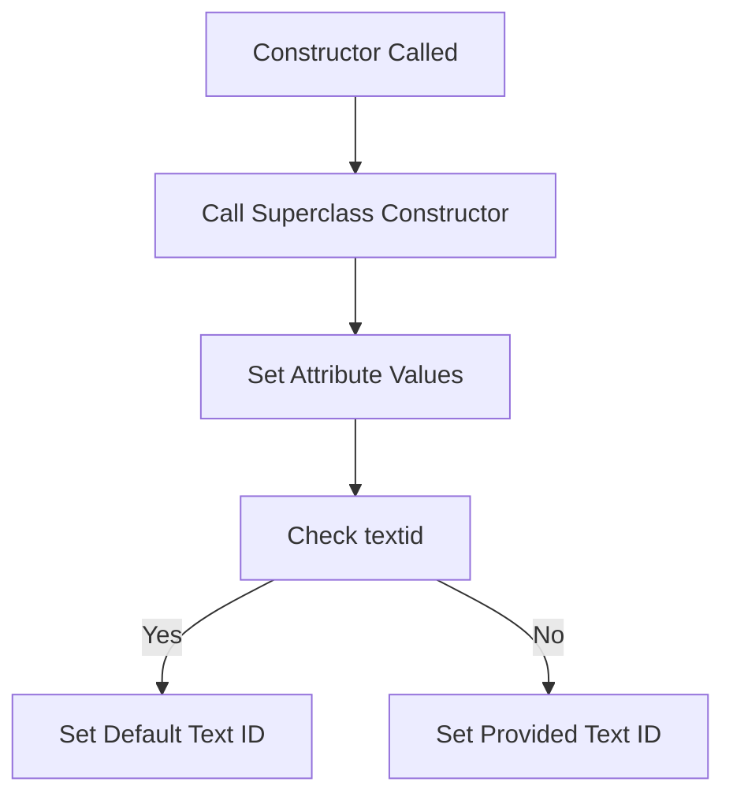

# Class ZCX_LLM_HTTP_ERROR

AI Generated documentation.

## Overview

The `ZCX_LLM_HTTP_ERROR` class is a final, public class that inherits from `CX_STATIC_CHECK`. It is designed to handle HTTP-related errors in an SAP ABAP environment. The class implements the `IF_T100_MESSAGE` interface, which suggests it is used for generating and managing error messages.

### Public Methods

- **CONSTRUCTOR**: The constructor method initializes the error object. It accepts optional parameters for the text ID and attributes (ATTR1, ATTR2, ATTR3, ATTR4), and a previous error object.

## Details

The `ZCX_LLM_HTTP_ERROR` class defines several constants that represent different types of HTTP errors. These constants are used to categorize and manage specific error scenarios. The class also includes data attributes (`MV_ATTR1`, `MV_ATTR2`, `MV_ATTR3`, `MV_ATTR4`) to store additional information related to the error.

### Error Constants

The class defines four main error constants:

1. **HTTP_CLIENT_NOT_INITIALIZED**: Represents an error where the HTTP client is not initialized.
2. **HTTP_COMMUNICATION_FAILURE**: Represents a failure in HTTP communication.
3. **HTTP_PROCESSING_FAILED**: Represents a failure in processing an HTTP request.
4. **HTTP_OTHERS**: A catch-all for other HTTP-related errors.

### Constructor Logic

The constructor method initializes the error object by calling the superclass constructor and setting the attribute values. If the `textid` parameter is not provided, it defaults to the default text ID defined in the `IF_T100_MESSAGE` interface.

### Interaction with `IF_T100_MESSAGE`

The class implements the `IF_T100_MESSAGE` interface, which is used for generating and managing error messages. This interface likely provides methods for setting and retrieving message details, which are utilized within the `ZCX_LLM_HTTP_ERROR` class to handle HTTP error messages effectively.
