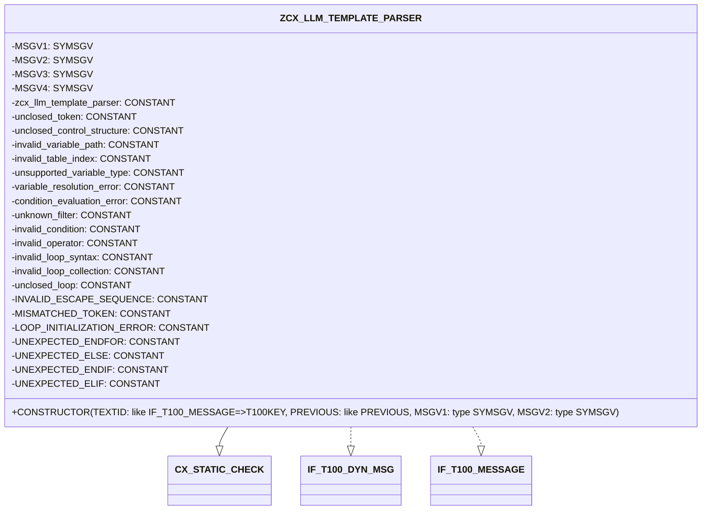
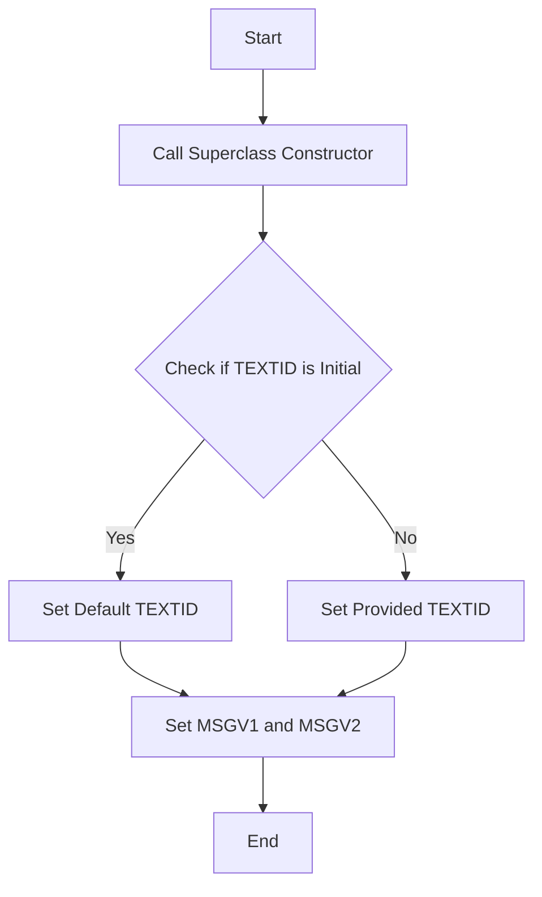

# Class ZCX_LLM_TEMPLATE_PARSER

AI Generated documentation.

## Overview

The `ZCX_LLM_TEMPLATE_PARSER` class is a final, public class that inherits from `CX_STATIC_CHECK`. It implements the interfaces `IF_T100_DYN_MSG` and `IF_T100_MESSAGE`. The class is designed to handle template parsing and validation, providing a structured way to manage and report errors during the parsing process. The main public method is the constructor, which initializes the object with optional parameters.

## Dependencies

The class depends on the following interfaces:

- `IF_T100_DYN_MSG`
- `IF_T100_MESSAGE`

## Details

The class defines a set of constants that represent various error messages, each with a unique message ID and number. These constants are used to standardize error reporting within the class. The class also defines several data attributes (`MSGV1`, `MSGV2`, `MSGV3`, `MSGV4`) of type `SYMSGV`, which are likely used to store error messages or related information.

The constructor method initializes the object and sets up the error message handling. It takes several optional parameters, including `TEXTID`, `PREVIOUS`, `MSGV1`, and `MSGV2`. The constructor calls the superclass constructor and then sets the `TEXTID` and message variables accordingly.

The constructor logic can be visualized as follows:

This diagram illustrates the flow of the constructor method, showing how it initializes the object and sets the necessary attributes based on the provided parameters.
