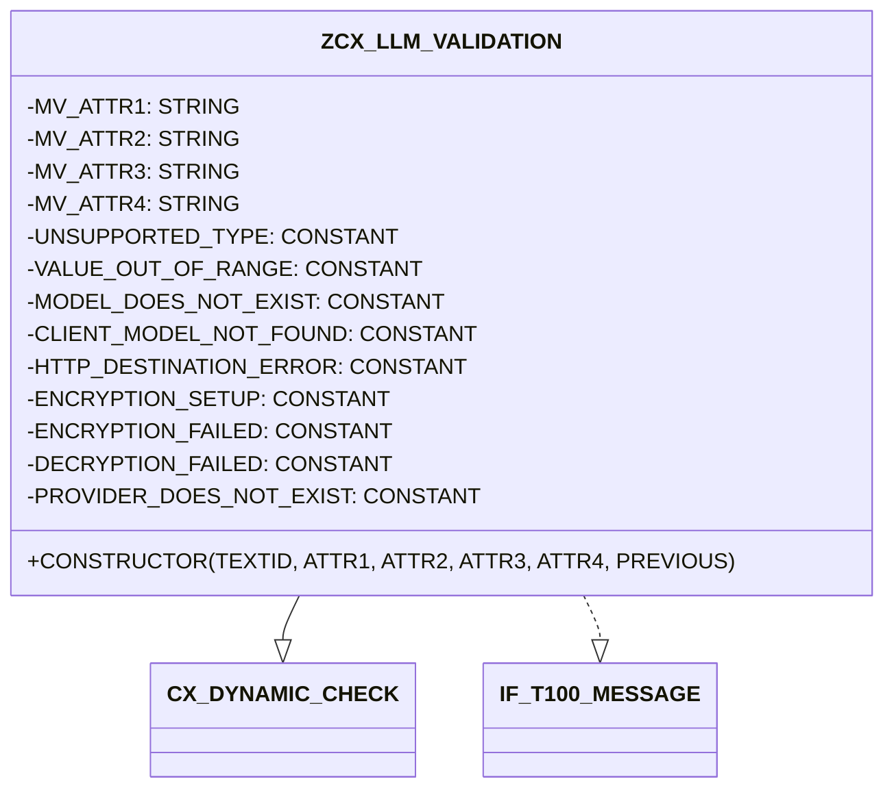
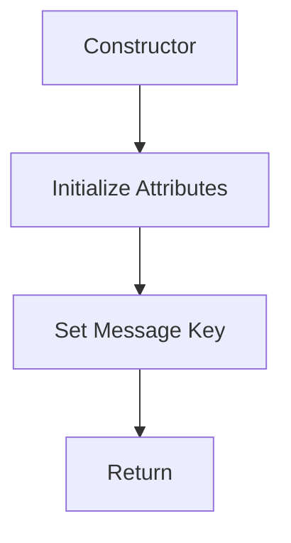

# Class ZCX_LLM_VALIDATION

AI Generated documentation.

## Overview

The `ZCX_LLM_VALIDATION` class is a final class that inherits from `CX_DYNAMIC_CHECK` and implements the `IF_T100_MESSAGE` interface. It is designed to handle various validation scenarios and message handling within the SAP system. The class provides a constructor method to initialize its attributes and set up the message handling.

### Public Methods

- **Constructor**: Initializes the class with optional parameters for message text ID and attributes. It sets up the message key and attributes based on the provided inputs.

## Dependencies

- **CX_DYNAMIC_CHECK**: The base class from which `ZCX_LLM_VALIDATION` inherits.
- **IF_T100_MESSAGE**: The interface implemented by `ZCX_LLM_VALIDATION` for message handling.

## Details

The `ZCX_LLM_VALIDATION` class is designed to handle specific validation scenarios and message handling. It defines several constants that represent different error messages, each with a unique message ID and attributes. These constants are used to standardize the error messages and their attributes within the class.

### Class Structure

The class structure can be visualized as follows:

### Constructor Details

The constructor method initializes the class with optional parameters for the message text ID and attributes. It sets up the message key and attributes based on the provided inputs. If the text ID is not provided, it defaults to the default text ID defined in the `IF_T100_MESSAGE` interface.

### Error Message Constants

The class defines several constants that represent different error messages. Each constant includes a message ID, message number, and attributes. These constants are used to standardize the error messages and their attributes within the class.

- **UNSUPPORTED_TYPE**: Represents an unsupported type error.
- **VALUE_OUT_OF_RANGE**: Represents a value out of range error.
- **MODEL_DOES_NOT_EXIST**: Represents a model does not exist error.
- **CLIENT_MODEL_NOT_FOUND**: Represents a client model not found error.
- **HTTP_DESTINATION_ERROR**: Represents an HTTP destination error.
- **ENCRYPTION_SETUP**: Represents an encryption setup error.
- **ENCRYPTION_FAILED**: Represents an encryption failed error.
- **DECRYPTION_FAILED**: Represents a decryption failed error.
- **PROVIDER_DOES_NOT_EXIST**: Represents a provider does not exist error.

These constants ensure that the error messages are consistent and easily identifiable within the system.
