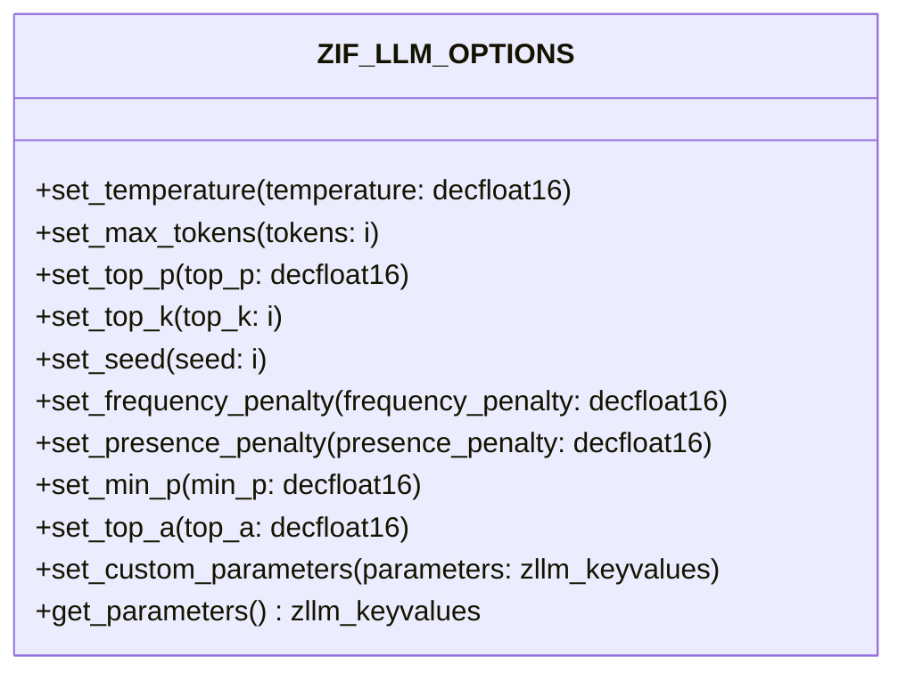

# Interface ZIF_LLM_OPTIONS

AI Generated documentation.

## Overview

The `ZIF_LLM_OPTIONS` interface provides a set of public methods to configure various options for a Large Language Model (LLM) call. These methods allow for the adjustment of parameters that influence the behavior and output of the LLM. The interface includes methods to set and get parameters, ensuring flexibility and control over the LLM's operation.

### Public Methods

The interface defines the following public methods:

- **set_temperature**: Sets the temperature parameter, which controls the randomness of the model's output. The value must be in the range [0, 2].
- **set_max_tokens**: Sets the maximum number of tokens allowed in the model's output. The value must be greater than 0.
- **set_top_p**: Sets the top-p parameter, which controls the diversity of the model's output. The value must be in the range [0, 1].
- **set_top_k**: Sets the top-k parameter, which controls the number of top probabilities to consider. The value must be in the range [1, infinity].
- **set_seed**: Sets the seed parameter, which ensures more repeatable output. The value must be an integer.
- **set_frequency_penalty**: Sets the frequency penalty parameter, which controls the penalty for frequent tokens. The value must be in the range [-2, 2].
- **set_presence_penalty**: Sets the presence penalty parameter, which controls the penalty for present tokens. The value must be in the range [-2, 2].
- **set_min_p**: Sets the min-p parameter, which controls the minimum probability threshold. The value must be in the range [0, 1].
- **set_top_a**: Sets the top-a parameter, which controls the top-a sampling. The value must be in the range [0, 1].
- **set_custom_parameters**: Sets a key-value list of custom parameters to be passed to the model.
- **get_parameters**: Retrieves all parameters set for the LLM call.

## Dependencies

The interface relies on the following main dependencies:

- **zcx_llm_validation**: An exception class used for validation purposes.
- **zllm_keyvalues**: A data type used for key-value pairs of parameters.
