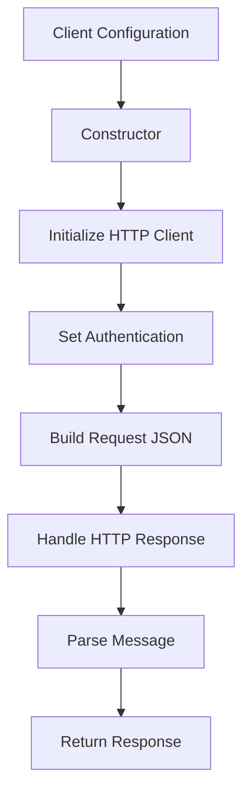

# Class ZCL_LLM_CLIENT_ANTHROPIC

AI Generated documentation.

## Overview

The `zcl_llm_client_anthropic` class is a specialized client for interacting with the Anthropic LLM (Large Language Model) service. It inherits from the base class `zcl_llm_client_base` and provides methods to configure, authenticate, and handle requests to the Anthropic API. The class is designed to manage the specifics of the Anthropic API, including message formatting, authentication, and response handling.

### Public Methods

- **`get_client`**: Factory method to create and return an instance of `zcl_llm_client_anthropic`.
  - **Parameters**:
    - `client_config`: Configuration settings for the client.
    - `provider_config`: Configuration settings for the provider.
  - **Returns**: An instance of `zif_llm_client`.

- **`constructor`**: Initializes the client with the provided configuration settings.
  - **Parameters**:
    - `client_config`: Configuration settings for the client.
    - `provider_config`: Configuration settings for the provider.

- **`zif_llm_client~new_request`**: Redefines the method to create a new request, setting specific options for the Anthropic model.
  - **Returns**: The modified request object.

## Dependencies

The class depends on the following:

- `zcl_llm_client_base`: The base class for LLM clients.
- `zif_llm_client`: Interface for LLM clients.
- `zcx_llm_validation`: Exception class for validation errors.
- `zcx_llm_authorization`: Exception class for authorization errors.
- `zcl_llm_http_client_wrapper`: Wrapper for HTTP client operations.
- `zcl_llm_common`: Common utility methods for LLM operations.
- `zllm_clnt_config`: Configuration settings for the client.
- `zllm_providers`: Configuration settings for the provider.
- `zllm_msgs`: Messages for LLM interactions.
- `zif_llm_chat_request`: Interface for chat request handling.
- `zif_llm_client`: Interface for LLM client operations.
- `zcl_llm_common`: Common utility methods for LLM operations.
- `zcl_llm_http_client_wrapper`: Wrapper for HTTP client operations.
- `zcl_llm_common`: Common utility methods for LLM operations.
- `zcl_llm_common`: Common utility methods for LLM operations.

## Details

### Class Structure

The class is structured into public, protected, and private sections. The public section includes the constructor and methods for interacting with the Anthropic API. The protected section includes methods for handling HTTP requests, authentication, and building request JSON. The private section defines internal data structures for handling Anthropic-specific message formats and response parsing.

### Interaction Flow

The interaction flow of the class can be visualized as follows:

### Key Methods

- **`get_http_client`**: Initializes and configures the HTTP client for Anthropic API requests.
  - Sets the `anthropic-version` header to `2023-06-01`.

- **`set_auth`**: Handles authentication by decrypting the encrypted authentication value and setting the appropriate header.
  - Uses the `zcl_llm_common` class to get the encryption implementation and decrypt the authentication value.

- **`build_request_json`**: Constructs the JSON request body for the Anthropic API.
  - Handles system and non-system messages differently.
  - Includes tool definitions if required.
  - Adds options and tool choices as needed.

- **`parse_message`**: Parses messages to the format expected by the Anthropic API.
  - Handles tool calls and differentiates between user and tool messages.

- **`handle_http_response`**: Processes the HTTP response from the Anthropic API.
  - Checks for errors and handles retriable errors.
  - Parses the response and constructs the internal response structure.

### Internal Data Structures

The class defines internal data structures to handle Anthropic-specific message formats and response parsing:

- **`anthropic_message`**: Represents a single message with type, text, ID, name, and input JSON.
- **`anthropic_messages`**: Table of `anthropic_message` objects.
- **`anthropic_usage`**: Represents usage statistics with input and output tokens.
- **`anthropic_response`**: Represents the response from the Anthropic API, including content, stop reason, role, and usage.
