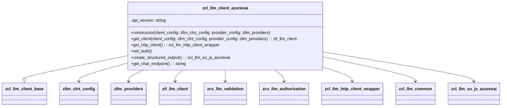

# Class ZCL_LLM_CLIENT_AZUREOAI

AI Generated documentation.

## Overview

The `zcl_llm_client_azureoai` class is a specialized client for interacting with the Azure OpenAI service. It inherits from the base class `zcl_llm_client_base` and provides functionality to create and manage client instances, handle authentication, and interact with the Azure OpenAI API.

### Public Methods

- **`get_client`**: Factory method to obtain a new instance of the Azure OpenAI client. It takes `client_config` and `provider_config` as inputs and returns a reference to the client instance. This method can raise `zcx_llm_validation` and `zcx_llm_authorization` exceptions.

- **`constructor`**: Initializes a new instance of the `zcl_llm_client_azureoai` class. It takes `client_config` and `provider_config` as inputs and can raise `zcx_llm_validation` and `zcx_llm_authorization` exceptions.

## Dependencies

- `zcl_llm_client_base`: Base class for LLM (Large Language Model) clients.
- `zllm_clnt_config`: Configuration type for client settings.
- `zllm_providers`: Configuration type for provider settings.
- `zif_llm_client`: Interface for LLM clients.
- `zcx_llm_validation`: Exception class for validation errors.
- `zcx_llm_authorization`: Exception class for authorization errors.
- `zcl_llm_http_client_wrapper`: Wrapper class for HTTP client operations.
- `zcl_llm_common`: Common utility class for LLM operations.
- `zcl_llm_so_js_azureoai`: Class for creating structured output in JSON format for Azure OpenAI.

## Details

### Class Diagram

### Method Details

#### `get_client`

The `get_client` method is a factory method that creates and returns a new instance of `zcl_llm_client_azureoai`. It takes `client_config` and `provider_config` as inputs and initializes the client instance. This method is crucial for obtaining a new client instance for interacting with the Azure OpenAI service.

#### `constructor`

The `constructor` method initializes a new instance of the `zcl_llm_client_azureoai` class. It calls the constructor of the base class `zcl_llm_client_base` and then performs any additional initialization required for the Azure OpenAI client.

#### `get_http_client`

The `get_http_client` method retrieves an HTTP client instance using the `zcl_llm_http_client_wrapper` class. It takes `client_config` and `provider_config` as inputs and returns the HTTP client instance. This method is used to handle HTTP requests to the Azure OpenAI API.

#### `set_auth`

The `set_auth` method handles the authentication process. It decrypts the authentication value if it is encrypted and sets the appropriate header in the HTTP client. The authentication type is determined by the `provider_config-auth_type` parameter.

#### `create_structured_output`

The `create_structured_output` method creates a structured output object of type `zcl_llm_so_js_azureoai`. This method is used to format the output in a structured JSON format for Azure OpenAI.

#### `get_chat_endpoint`

The `get_chat_endpoint` method constructs and returns the chat endpoint URL for the Azure OpenAI service. It uses the `client_config-provider_model` and the `api_version` constant to build the URL.
