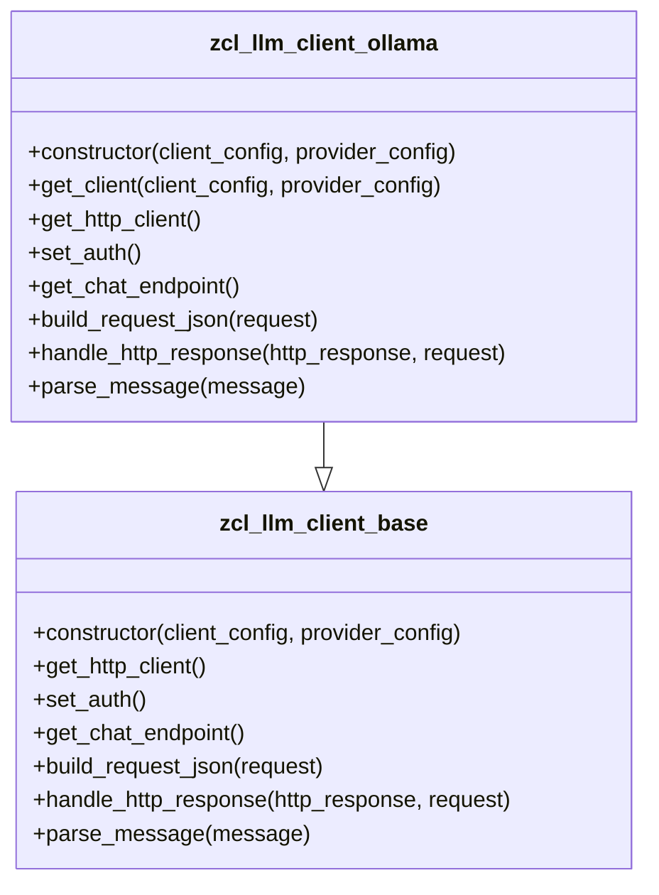

# Class ZCL_LLM_CLIENT_OLLAMA

AI Generated documentation.

## Overview

The `zcl_llm_client_ollama` class is a specialized client for interacting with the Ollama provider, inheriting from the base class `zcl_llm_client_base`. It is designed to handle specific configurations and interactions required by the Ollama API. The class provides public methods for initializing the client, building HTTP requests, handling responses, and parsing messages.

### Public Methods

- **`get_client`**: This class method creates and returns an instance of `zcl_llm_client_ollama` based on the provided configuration parameters.
  - **Parameters**:
    - `client_config`: Configuration for the client.
    - `provider_config`: Configuration specific to the Ollama provider.
  - **Returns**: An instance of `zif_llm_client`.
  - **Exceptions**: `zcx_llm_validation`, `zcx_llm_authorization`.

- **`constructor`**: Initializes an instance of `zcl_llm_client_ollama` with the given configuration parameters.
  - **Parameters**:
    - `client_config`: Configuration for the client.
    - `provider_config`: Configuration specific to the Ollama provider.
  - **Exceptions**: `zcx_llm_validation`, `zcx_llm_authorization`.

## Dependencies

- **Base Class**: `zcl_llm_client_base`
- **Interfaces**: `zif_llm_client`
- **Exceptions**: `zcx_llm_validation`, `zcx_llm_authorization`
- **Types**: `zllm_clnt_config`, `zllm_providers`

## Details

### Class Structure and Inheritance

The class `zcl_llm_client_ollama` extends `zcl_llm_client_base` and overrides several methods to provide Ollama-specific functionality. The class structure is as follows:

### Method Details

#### `get_http_client`

This method retrieves an HTTP client instance using the `zcl_llm_http_client_wrapper` class. It is a redefinition of the base class method and is specific to the Ollama provider.

#### `set_auth`

This method sets the authentication headers for the HTTP client. It handles optional API keys and decryption of encrypted authentication data using the `zcl_llm_common` class.

#### `build_request_json`

This method builds the JSON request for the Ollama API. It modifies the request to include Ollama-specific parameters and handles structured output if required. The method ensures that the request is formatted correctly for the Ollama API.

#### `get_chat_endpoint`

This method returns the chat endpoint specific to the Ollama provider.

#### `handle_http_response`

This method processes the HTTP response from the Ollama API. It handles errors, parses the response, and maps tool calls to the available tools. The method ensures that the response is correctly formatted and includes all necessary details.

#### `parse_message`

This method parses a message and formats it according to the Ollama API requirements. It handles tool calls and ensures that the message is correctly structured for the API.

### Interaction with External Classes and Types

The class interacts with several external classes and types to handle configuration, authentication, and request/response processing. Key interactions include:

- **`zcl_llm_http_client_wrapper`**: Used to retrieve the HTTP client instance.
- **`zcl_llm_common`**: Used for JSON parsing and encryption/decryption.
- **`zcl_llm_client_base`**: Base class providing common functionality.
- **`zif_llm_client`**: Interface for the LLM client.
- **`zcx_llm_validation`**, **`zcx_llm_authorization`**: Exceptions for validation and authorization errors.

### Data Types

The class defines several internal data types to structure the request and response data:

- **`ollama_function`**: Represents a function with a name and arguments.
- **`ollama_tool_call`**: Represents a tool call with an ID, type, and function.
- **`ollama_message`**: Represents a message with a role, content, and tool calls.
- **`ollama_response`**: Represents the response from the Ollama API, including prompt evaluation count, evaluation count, message, and done reason.

These data types ensure that the request and response data are structured correctly for the Ollama API.
