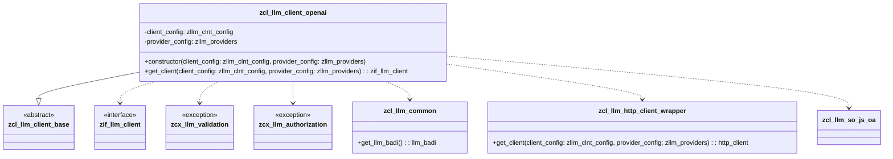
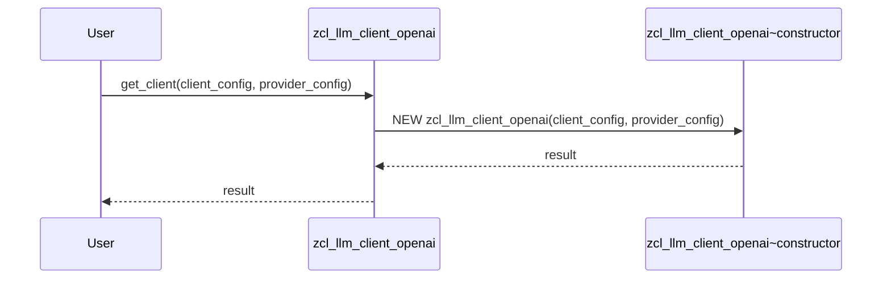
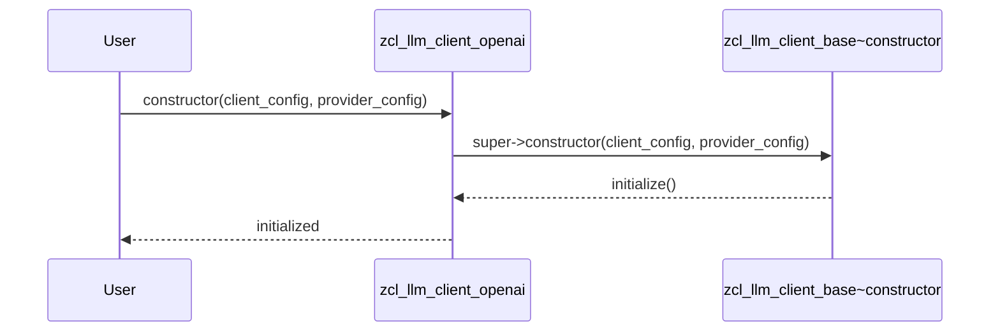
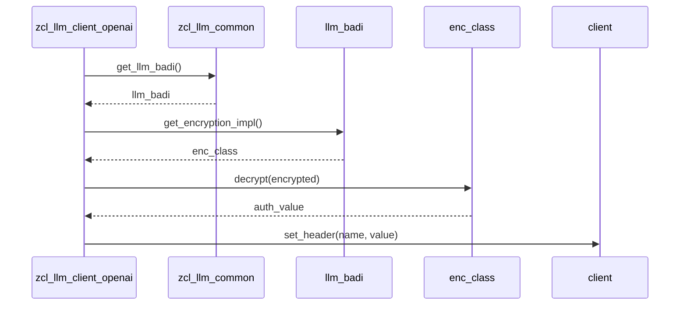

# Class ZCL_LLM_CLIENT_OPENAI

AI Generated documentation.

## Overview

The `zcl_llm_client_openai` class is a specialized client for interacting with the OpenAI API, inheriting from the base class `zcl_llm_client_base`. It provides functionality to configure and manage interactions with the OpenAI service, including authentication, endpoint management, and structured output creation. The class exposes public methods for instantiation and client retrieval, along with protected methods for redefining specific behaviors.

### Public Methods

- **`get_client`**: This class method creates and returns an instance of `zcl_llm_client_openai` based on the provided configuration parameters. It raises exceptions for validation and authorization errors.

  ```abap
  METHOD get_client
    IMPORTING
      client_config   TYPE zllm_clnt_config
      provider_config TYPE zllm_providers
    RETURNING
      VALUE(result)   TYPE REF TO zif_llm_client
    RAISING
      zcx_llm_validation
      zcx_llm_authorization
  ENDMETHOD.
  ```

- **`constructor`**: This method initializes an instance of `zcl_llm_client_openai` with the given configuration parameters. It calls the superclass constructor and performs additional initialization.

  ```abap
  METHOD constructor
    IMPORTING
      client_config   TYPE zllm_clnt_config
      provider_config TYPE zllm_providers
    RAISING
      zcx_llm_validation
      zcx_llm_authorization
  ENDMETHOD.
  ```

## Dependencies

- `zcl_llm_client_base`: The base class from which `zcl_llm_client_openai` inherits.
- `zif_llm_client`: The interface that the client implements.
- `zcx_llm_validation`: Exception class for validation errors.
- `zcx_llm_authorization`: Exception class for authorization errors.
- `zcl_llm_common`: Utility class for common LLM operations.
- `zcl_llm_http_client_wrapper`: Wrapper class for HTTP client operations.
- `zcl_llm_so_js_oa`: Class for creating structured output.

## Details

### Class Diagram



### Method Details

#### `get_client`

This method is responsible for creating and returning an instance of `zcl_llm_client_openai`. It takes configuration parameters for the client and provider, and raises exceptions if validation or authorization fails.



#### `constructor`

The constructor initializes the client with the provided configuration parameters. It calls the superclass constructor and performs additional initialization.



#### `get_chat_endpoint`

This method returns the endpoint for chat completions, which is a fixed value.

```abap
METHOD get_chat_endpoint.
  result = '/chat/completions'.
ENDMETHOD.
```

#### `set_auth`

This method sets the authorization header for the HTTP client. It decrypts the authentication token if it is encrypted and sets the appropriate header.



#### `create_structured_output`

This method creates and returns an instance of `zcl_llm_so_js_oa` for structured output.

```abap
METHOD create_structured_output.
  result = NEW zcl_llm_so_js_oa().
ENDMETHOD.
```

#### `get_http_client`

This method retrieves an HTTP client instance using the provided configuration parameters.

```abap
METHOD get_http_client.
  client = zcl_llm_http_client_wrapper=>get_client(client_config, provider_config).
ENDMETHOD.
```
