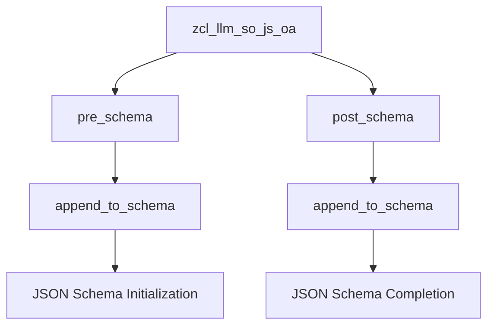

# Class ZCL_LLM_SO_JS_OA

AI Generated documentation.

## Overview

The class `zcl_llm_so_js_oa` is a final class that inherits from `zcl_llm_so_js`. It is designed to implement a specific JSON schema for OpenAI, focusing on the `pre_schema` and `post_schema` methods. These methods are redefined to append specific JSON schema components before and after the main schema processing.

## Dependencies

The class `zcl_llm_so_js_oa` inherits from `zcl_llm_so_js`. This inheritance indicates that it relies on the functionality provided by the base class, particularly the methods and properties defined there.

## Details

The class `zcl_llm_so_js_oa` extends the functionality of `zcl_llm_so_js` by redefining the `pre_schema` and `post_schema` methods. These methods are crucial for modifying the JSON schema to include specific components required for OpenAI integration.

### Method Details

#### `pre_schema`

The `pre_schema` method is redefined to append a specific JSON schema component before the main schema processing. This method calls `append_to_schema` with the following JSON fragment:

```json
{
  "name": "Response",
  "strict": true,
  "schema": {
```

This fragment sets the name of the response to "Response", enforces strict schema validation, and initializes the schema object.

#### `post_schema`

The `post_schema` method is redefined to append a closing bracket to the JSON schema after the main schema processing. This method calls `append_to_schema` with the following JSON fragment:

```json
}
```

This fragment closes the schema object, completing the JSON schema structure.

### Interaction Flow

The interaction flow of the class can be visualized as follows:



In this flow:

- The `pre_schema` method is called to initialize the JSON schema with specific components.
- The `post_schema` method is called to complete the JSON schema structure.
- Both methods use the `append_to_schema` method to modify the schema, ensuring that the JSON schema is correctly formatted for OpenAI integration.
