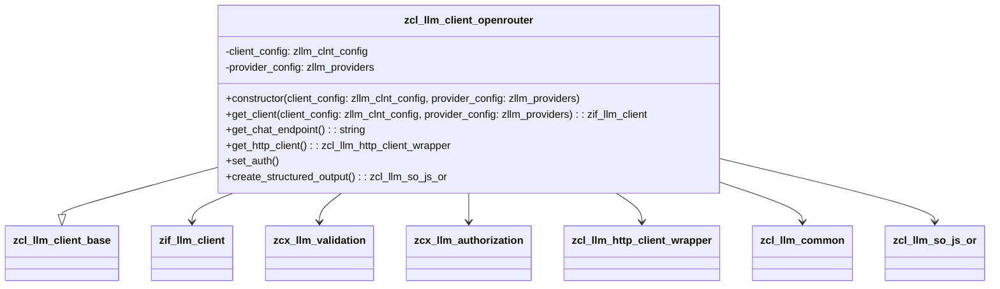

# Class ZCL_LLM_CLIENT_OPENROUTER

AI Generated documentation.

## Overview

The `zcl_llm_client_openrouter` class is a specialized client for interacting with the OpenRouter API, inheriting from the base class `zcl_llm_client_base`. It provides functionality to configure and manage HTTP clients, set authentication, and create structured outputs. The class is designed to handle specific configurations and interactions required for the OpenRouter service.

### Public Methods

- **`get_client`**: This class method creates and returns an instance of `zcl_llm_client_openrouter` based on the provided client and provider configurations. It raises exceptions for validation and authorization errors.

- **`constructor`**: This method initializes an instance of `zcl_llm_client_openrouter` with the given client and provider configurations. It calls the superclass constructor and performs additional initialization.

## Dependencies

- `zcl_llm_client_base`: The base class from which `zcl_llm_client_openrouter` inherits.
- `zif_llm_client`: The interface that the client implements.
- `zcx_llm_validation`: Exception class for validation errors.
- `zcx_llm_authorization`: Exception class for authorization errors.
- `zcl_llm_http_client_wrapper`: Utility class for obtaining an HTTP client.
- `zcl_llm_common`: Utility class for obtaining encryption implementations.
- `zcl_llm_so_js_or`: Class for creating structured outputs.

## Details

### Class Diagram

### Method Details

#### `get_client`

This method creates a new instance of `zcl_llm_client_openrouter` using the provided configurations. It is a class method, meaning it can be called without creating an instance of the class.

#### `constructor`

The constructor initializes the instance by calling the superclass constructor and performing additional setup. It ensures that the client is properly configured with the given client and provider settings.

#### `get_chat_endpoint`

This method returns the endpoint for chat completions, which is a fixed string `'/chat/completions'`.

#### `get_http_client`

This method retrieves an HTTP client using the `zcl_llm_http_client_wrapper` utility class. It sets specific headers for OpenRouter statistics, including the referer and title.

#### `set_auth`

This method handles authentication by decrypting the encrypted authentication value if provided and setting the appropriate authorization header. It uses the Business Add-In (BADI) mechanism to obtain the encryption implementation.

#### `create_structured_output`

This method creates and returns an instance of `zcl_llm_so_js_or`, which is used for structured output.
