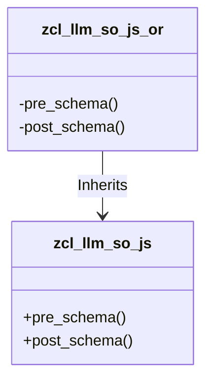

# Class ZCL_LLM_SO_JS_OR

AI Generated documentation.

## Overview

The class `zcl_llm_so_js_or` is a final class that inherits from `zcl_llm_so_js`. It does not define any public methods but redefines two protected methods: `pre_schema` and `post_schema`. These methods are likely used to manipulate or extend the schema of a JSON structure, as suggested by their names and the content of their implementations.

## Dependencies

There are no explicit dependencies listed in the provided code. However, the class inherits from `zcl_llm_so_js`, indicating a dependency on that class.

## Details

The class `zcl_llm_so_js_or` redefines the `pre_schema` and `post_schema` methods to manipulate the schema of a JSON structure. The `pre_schema` method appends a JSON object with a "name" and "strict" property to the schema, while the `post_schema` method appends a closing brace to the schema. This suggests that the class is used to extend or modify the schema of a JSON structure in a specific way.

The `pre_schema` method is called before the schema is processed, and the `post_schema` method is called after the schema is processed. This allows the class to insert or modify the schema at specific points in the processing flow. The exact details of the schema manipulation are not provided, but the use of the `append_to_schema` method suggests that the schema is being extended or modified in some way.
