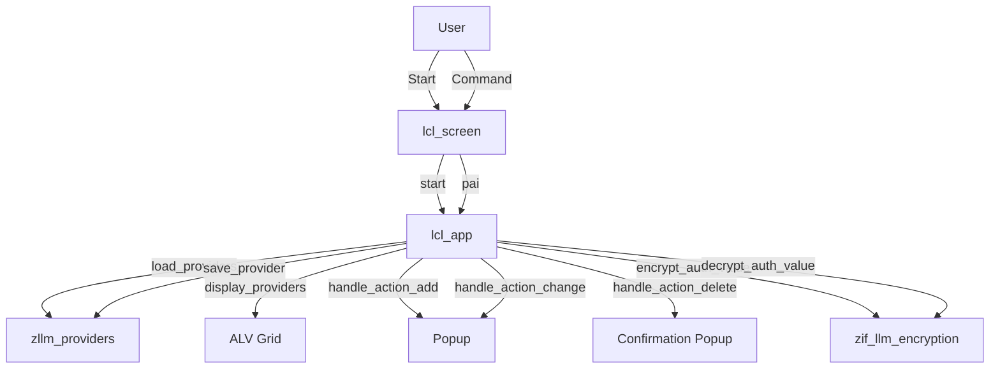

# Report ZLLM_PROVIDER_MAINTENANCE

AI Generated documentation.

## Overview

The report `zllm_provider_maintenance` is an ABAP program designed for maintaining provider configurations. The main functionality includes displaying a list of providers in an ALV grid, adding new providers, updating existing providers, and deleting providers. The program utilizes a class-based approach to encapsulate the business logic and user interactions.

The main code objects are:

- **Class `lcl_app`**: This class handles the core functionality of the application, including loading providers, displaying them in an ALV grid, and handling user actions such as adding, changing, and deleting providers.
- **Class `lcl_screen`**: This class manages the screen flow and user interactions, calling the appropriate methods in `lcl_app` based on user commands.

## Dependencies

The report depends on the following main objects:

- **Table `zllm_providers`**: Stores the provider configurations.
- **Class `zif_llm_encryption`**: Provides encryption and decryption methods for authentication values.
- **BADI `llm_badi`**: Used to get the encryption implementation.
- **Function Modules `LVC_FIELDCATALOG_MERGE`, `POPUP_GET_VALUES`, `POPUP_TO_CONFIRM`**: Used for building the ALV field catalog, displaying input popups, and confirmation popups respectively.

## Details

### Class `lcl_app`

The `lcl_app` class is the core of the application, handling all the business logic and user interactions. Below is a detailed breakdown of its methods and internal logic.

#### Methods

- **Constructor**: Initializes the application by loading providers and setting up the encryption class.
- **`load_providers`**: Loads the provider list from the database table `zllm_providers`.
- **`display_providers`**: Displays the providers in an ALV grid. If the grid is not bound, it initializes the grid and sets up the field catalog and layout. If the grid is already bound, it refreshes the display.
- **`handle_action_add`**: Handles the addition of a new provider. It shows a popup for user input, encrypts the authentication value, and saves the new provider.
- **`handle_action_change`**: Handles the updating of an existing provider. It shows a popup for user input, decrypts the authentication value, updates the provider, and saves the changes.
- **`handle_action_delete`**: Handles the deletion of a provider. It shows a confirmation popup and deletes the provider from the database if confirmed.
- **`save_provider`**: Saves a provider configuration to the database.
- **`encrypt_auth_value`**: Encrypts an authentication value using the encryption class.
- **`decrypt_auth_value`**: Decrypts an encrypted authentication value using the encryption class.
- **`build_field_catalog`**: Builds the field catalog for the ALV grid.
- **`refresh_display`**: Refreshes the ALV grid display.
- **`show_popup`**: Shows a user input popup and returns the configuration.
- **`show_confirm_popup`**: Shows a confirmation popup and returns the user's choice.

### Class `lcl_screen`

The `lcl_screen` class manages the screen flow and user interactions. It calls the appropriate methods in `lcl_app` based on user commands.

#### Methods

- **`start`**: Initializes the application and calls the initial screen.
- **`pai`**: Processes user commands and calls the appropriate methods in `lcl_app`.
- **`pbo`**: Sets the screen status and title, and displays the providers.

### Interaction Flow

The interaction flow between the main components can be visualized as follows:

### Encryption and Decryption

The encryption and decryption of authentication values are handled by the `zif_llm_encryption` class. The `encrypt_auth_value` and `decrypt_auth_value` methods in `lcl_app` use this class to perform the encryption and decryption operations.

### Error Handling

The program includes error handling for encryption and decryption operations. If an error occurs, an appropriate message is displayed to the user.

### User Interface

The user interface is managed through the `lcl_screen` class, which handles screen flow and user commands. The main screen displays the providers in an ALV grid and provides options to add, change, and delete providers.
